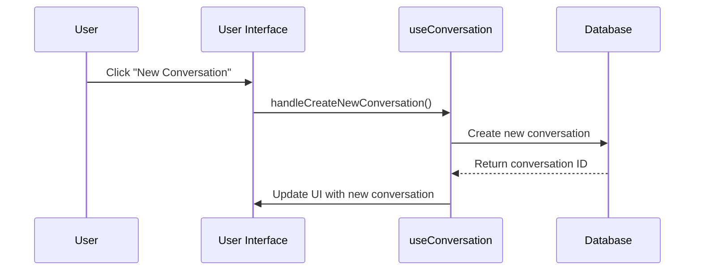
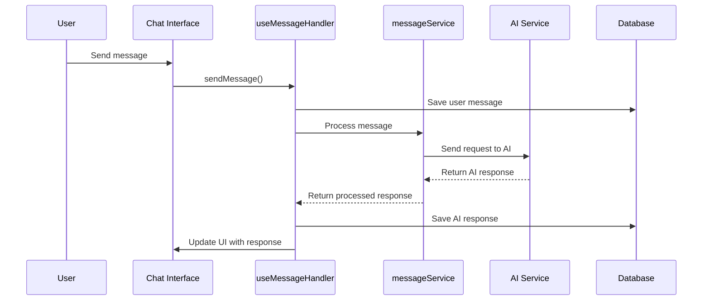
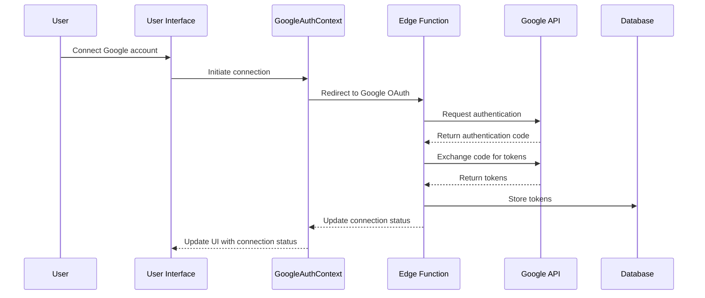

# Complete Project Documentation

## Table of Contents
1. [Project Overview](#project-overview)
2. [Architecture](#architecture)
   - [Core Components](#core-components)
   - [State Management](#state-management)
   - [Data Flow](#data-flow)
3. [Key Features](#key-features)
4. [Authentication System](#authentication-system)
5. [Conversation System](#conversation-system)
6. [Messaging System](#messaging-system)
7. [AI Integration](#ai-integration)
8. [Google Integration](#google-integration)
9. [Media Gallery](#media-gallery)
10. [Context Management](#context-management)
11. [Memory System](#memory-system)
12. [Technical Workflows](#technical-workflows)
13. [Function Reference](#function-reference)
14. [Database Schema](#database-schema)
15. [Future Enhancements](#future-enhancements)

## Project Overview

This application is a multi-modal AI chat platform that allows users to interact with various AI models through text, image generation, video generation, and audio generation. The platform provides a seamless user experience with a conversational interface, media gallery, and integration with external AI services.

The core functionalities include:
- Multi-modal AI interaction (text, image, video, audio)
- Conversation management with persistent history
- Media gallery for generated content
- User authentication and account management
- Google service integration 
- Memory system for contextual responses

## Architecture

### Core Components

The application follows a modern React architecture with clear separation of concerns:

```
src/
├── components/      # Reusable UI components
│   ├── ui/          # Basic UI components (shadcn/ui)
│   ├── conversation/# Conversation-related components 
│   ├── chat/        # Chat interface components
│   └── gallery/     # Gallery-related components
├── contexts/        # React contexts for global state
├── hooks/           # Custom React hooks
├── services/        # Business logic and API services
├── types/           # TypeScript type definitions
├── utils/           # Utility functions
├── pages/           # Page components
└── integrations/    # External service integrations
```

### State Management

The application uses a combination of React Context API and custom hooks for state management:

1. **Auth Context**: Manages user authentication state
   - Provides user info, login/logout functions
   - Handles session persistence

2. **Google Auth Context**: Manages Google integration state
   - Tracks connection status
   - Handles token refresh and permissions

3. **Custom Hooks**: For feature-specific state management
   - `useConversation`: Manages conversation state and operations
   - `useConversationMessages`: Manages message state
   - `useMessageHandler`: Orchestrates message sending and processing
   - `useMediaGallery`: Manages media gallery operations

### Data Flow

The application follows a unidirectional data flow pattern:

1. User interactions trigger state changes
2. State changes trigger UI updates
3. API calls are made through service layers
4. API responses update state
5. State updates trigger UI re-renders

## Key Features

### Multi-Modal AI Interaction

The application supports multiple modes of AI interaction:

1. **Text Mode**: Standard text-based chat with AI models
2. **Image Mode**: Generate images from text prompts
3. **Video Mode**: Generate videos from text prompts
4. **Audio Mode**: Generate audio from text prompts

### Conversation Management

Users can:
- Create new conversations
- View conversation history
- Rename conversations
- Delete conversations
- Switch between conversations

### Media Gallery

A dedicated section to:
- View generated media
- Filter media by type
- Delete media items
- Access media metadata

### Google Integration

The application integrates with Google services:
- Authentication via Google
- Access to Google APIs
- Permission management
- Token refresh handling

## Authentication System

### Components

- `AuthContext.tsx`: Provides authentication state and functions
- `Auth.tsx`: Authentication page UI
- `UserMenu.tsx`: User profile and logout options

### Authentication Flow

1. User accesses the application
2. If not authenticated, redirected to Auth page
3. User enters credentials or authenticates with Google
4. On successful authentication, user is redirected to the main application
5. Auth state is maintained across the application

## Conversation System

### Components

- `ConversationSidebar.tsx`: Displays conversation list
- `ConversationList.tsx`: List of user conversations
- `ConversationItem.tsx`: Individual conversation item
- `ChatInterface.tsx`: Main chat interface
- `useConversation.ts`: Core conversation management hook

### Conversation Flow

1. User creates or selects a conversation
2. Messages for the selected conversation are loaded
3. User interacts with the AI through the chat interface
4. Messages are saved to the database
5. Conversation state is updated in real-time

### Key Functions

- `loadConversationMessages`: Loads messages for a conversation
- `handleCreateNewConversation`: Creates a new conversation
- `handleDeleteConversation`: Deletes a conversation
- `handleRenameConversation`: Renames a conversation
- `forceReloadMessages`: Forces reload of conversation messages

## Messaging System

### Components

- `ChatMessage.tsx`: Renders individual messages
- `ChatInput.tsx`: Input for sending messages
- `useMessageHandler.ts`: Handles message sending
- `messageService.ts`: Message processing service

### Messaging Flow

1. User types a message in the input field
2. Message is sent to the message handler
3. Message content is analyzed for mode detection
4. Message is processed by the appropriate AI service
5. Response is displayed in the chat interface
6. Messages are saved to the database

### Key Functions

- `sendMessage`: Sends a message to be processed
- `handleSingleModelMessage`: Processes a message for a single model
- `handleCompareModels`: Processes a message for model comparison
- `prepareConversationHistory`: Prepares conversation history for AI context

## AI Integration

### Services

- `apiService.ts`: Handles API communication
- `singleModelHandler.ts`: Handles single model requests
- `compareModelsHandler.ts`: Handles comparison between models
- `chatModeUtils.ts`: Utilities for different chat modes

### AI Request Flow

1. User sends a message
2. Message is formatted with appropriate context
3. Request is sent to the AI service
4. Response is processed based on mode
5. Formatted response is returned to the UI

## Google Integration

### Components

- `GoogleAuthContext.tsx`: Manages Google authentication state
- `useGoogleTokens.ts`: Manages Google API tokens
- `googleAuthOperations.ts`: Google authentication operations

### Google Integration Flow

1. User initiates Google connection
2. OAuth consent screen is displayed
3. User grants permissions
4. Tokens are stored in the database
5. Google services become available in the application

## Media Gallery

### Components

- `MediaGallery.tsx`: Media gallery page
- `GalleryList.tsx`: Displays media items
- `GalleryMediaCard.tsx`: Individual media item card
- `useMediaGallery.ts`: Media gallery operations

### Media Gallery Flow

1. User accesses the gallery page
2. Media items are loaded from the database
3. User can filter and sort media items
4. User can view and delete media items

## Context Management

The context management system ensures that AI responses maintain context throughout a conversation. 

### Key Components

- `contextUtils.ts`: Utilities for context management
- `useMessageProcessing.ts`: Processes messages for context extraction

### Context Flow

1. User messages are processed to extract important information
2. Past messages are filtered to create a relevant context
3. Context is formatted for the AI model
4. AI generates responses based on the provided context
5. Context is maintained across multiple messages

### Key Functions

- `cleanContentForContext`: Cleans message content for context
- `filterMessagesForContext`: Filters messages to include in context
- `formatMessagesForContext`: Formats messages for AI context
- `prepareFullContext`: Prepares the full context with conversation history and user memory

## Memory System

The memory system extracts and stores important information from conversations to provide personalized context.

### Components

- `memoryService.ts`: Memory-related operations
- `userMemoryRepository.ts`: Data access for user memory
- `contentAnalysisService.ts`: Analyzes content for memory extraction

### Memory Flow

1. User messages are analyzed for important information
2. Information is extracted and stored in the memory database
3. Memory is used to enhance future AI responses
4. User can view and manage their memory items

## Technical Workflows

### Conversation Creation Workflow



### Message Sending Workflow



### Google Integration Workflow



## Function Reference

### Conversation Hooks

#### `useConversation`

The central hook for conversation management.

**Key Functions:**
- `loadConversationMessages(conversationId)`: Loads messages for a specific conversation
- `forceReloadMessages()`: Forces reload of the current conversation
- `createNewConversation()`: Creates a new conversation
- `deleteConversation(id)`: Deletes a conversation
- `renameConversation(id, newTitle)`: Renames a conversation
- `updateTitle(conversationId, content)`: Updates a conversation title based on content

#### `useConversationState`

Manages conversation state.

**Key Functions:**
- `setCurrentConversationId(id)`: Sets the current conversation
- `updateConversations(conversations)`: Updates the conversation list
- `addConversation(conversation)`: Adds a new conversation
- `updateConversationTitle(id, title)`: Updates a conversation title
- `removeConversation(id)`: Removes a conversation from state

#### `useConversationMessages`

Manages message state.

**Key Functions:**
- `clearMessages()`: Clears all messages
- `setMessages(messages)`: Sets the message list
- `addUserMessage(message)`: Adds a user message
- `addAssistantMessage(message)`: Adds an assistant message
- `addErrorMessage(message)`: Adds an error message
- `saveUserMessage(message, conversationId)`: Saves a user message to the database
- `removeLoadingMessages()`: Removes loading messages

### Message Hooks

#### `useMessageHandler`

Handles message sending and processing.

**Key Functions:**
- `sendMessage(content, mode, modelId, comparing, leftModel, rightModel, files, params)`: Sends a message for processing
- `detectContentType(content)`: Detects the appropriate mode for content

#### `useMessageProcessing`

Processes messages for context and memory.

**Key Functions:**
- `processUserMessageForMemory(content)`: Extracts memory from a message
- `getMemoryContext()`: Gets the user's memory context
- `prepareConversationHistory(messages)`: Prepares conversation history for context
- `detectContentType(content)`: Detects content type for mode switching

### Context Utilities

#### `contextUtils.ts`

Utilities for context management.

**Key Functions:**
- `cleanContentForContext(content)`: Cleans message content for context
- `filterMessagesForContext(messages, maxMessages)`: Filters messages for context
- `formatMessagesForContext(messages, includeModelInfo)`: Formats messages for context
- `prepareFullContext(messages, userMemoryContext, maxMessages)`: Prepares the full context

### Services

#### `messageService.ts`

Service for message processing.

**Key Functions:**
- `handleSingleModelMessage(content, mode, modelId, conversationId, messages, conversations, files, params, context, userId, skipAddUserMessage)`: Handles a message for a single model
- `handleCompareModels(content, mode, leftModel, rightModel, conversationId, messages, files, params, context, userId)`: Handles a message for model comparison

#### `memoryService.ts`

Service for memory operations.

**Key Functions:**
- `extractMemoryFromMessage(content, userId)`: Extracts memory from a message
- `getUserMemoryContext(userId)`: Gets the user's memory context
- `detectContentTypeAndMode(content)`: Detects content type and mode

## Database Schema

### Key Tables

1. **conversations**: Stores conversation metadata
   - `id`: Unique identifier
   - `user_id`: User who owns the conversation
   - `title`: Conversation title
   - `created_at`: Creation timestamp
   - `updated_at`: Last update timestamp

2. **messages**: Stores individual messages
   - `id`: Unique identifier
   - `conversation_id`: Associated conversation
   - `sender`: Message sender (user/assistant)
   - `content`: Message content
   - `timestamp`: Creation timestamp
   - `model`: AI model used (if applicable)
   - `mode`: Message mode (text/image/video/audio)
   - `files`: Attached files
   - `media_url`: URL for generated media

3. **media_gallery**: Stores generated media
   - `id`: Unique identifier
   - `user_id`: User who owns the media
   - `media_url`: URL to the media
   - `media_type`: Type of media
   - `prompt`: Prompt used to generate
   - `model_id`: Model used to generate
   - `created_at`: Creation timestamp
   - `metadata`: Additional media metadata

4. **user_memory**: Stores user memory items
   - `id`: Unique identifier
   - `user_id`: Associated user
   - `key_name`: Memory key
   - `value`: Memory value
   - `source`: Source of the memory
   - `created_at`: Creation timestamp
   - `updated_at`: Last update timestamp

5. **user_google_tokens**: Stores Google API tokens
   - `id`: Unique identifier
   - `user_id`: Associated user
   - `access_token`: Google access token
   - `refresh_token`: Google refresh token
   - `expires_at`: Token expiration timestamp
   - `created_at`: Creation timestamp
   - `updated_at`: Last update timestamp

## Future Enhancements

1. **Advanced Memory System**
   - Improved entity extraction
   - Semantic search for memory items
   - User-controlled memory management

2. **Enhanced Media Processing**
   - Support for more media formats
   - Media editing capabilities
   - Media organization features

3. **Expanded Google Integration**
   - Integration with more Google services
   - Enhanced permission management
   - Multi-account support

4. **Real-time Collaboration**
   - Shared conversations
   - Collaborative editing
   - User presence indicators

5. **Advanced Analytics**
   - Conversation analytics
   - Usage statistics
   - Performance metrics

6. **Mobile Application**
   - Native mobile experience
   - Offline capabilities
   - Push notifications

This documentation provides a comprehensive overview of the project's architecture, components, workflows, and functions. It serves as a reference for understanding how the different parts of the application work together and how to extend or modify the functionality.
