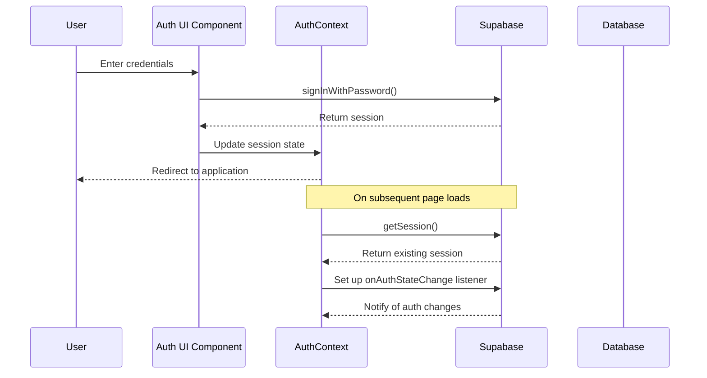
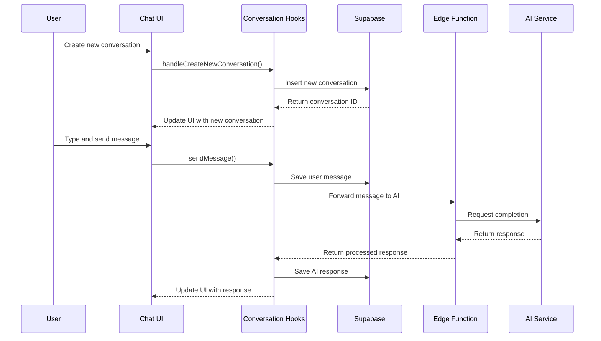
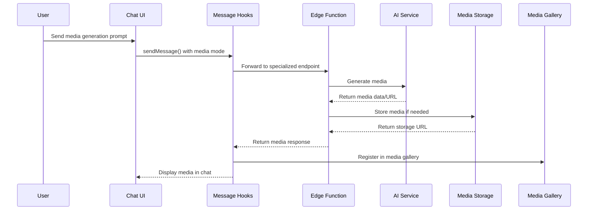
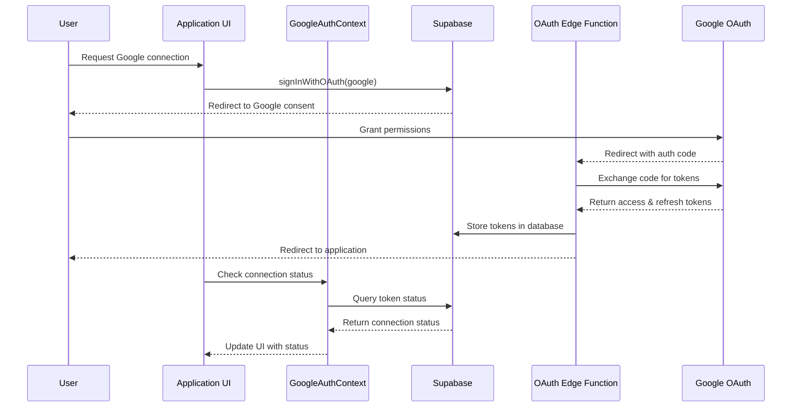
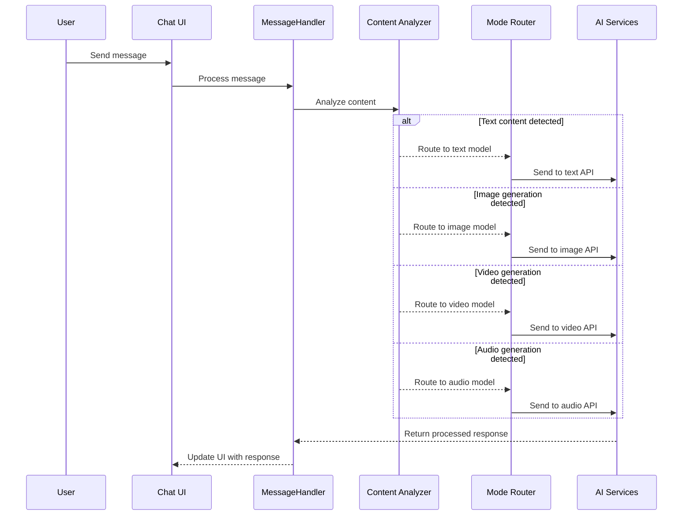

# Comprehensive Project Documentation

## Table of Contents

1. [Project Overview](#project-overview)
2. [Technology Stack](#technology-stack)
3. [Architecture](#architecture)
4. [Authentication System](#authentication-system)
5. [Google Integration](#google-integration)
6. [Messaging System](#messaging-system)
7. [Technical Workflows](#technical-workflows)
8. [Database Schema](#database-schema)
9. [Performance Considerations](#performance-considerations)
10. [Security Considerations](#security-considerations)
11. [Error Handling](#error-handling)
12. [Future Enhancements](#future-enhancements)
13. [System Requirements](#system-requirements)

---

## Project Overview

This application is a multi-modal AI chat platform that allows users to interact with various AI models through text, image generation, video generation, and audio generation. The application provides a seamless user experience with a conversational interface, media gallery, and integration with external AI services.

The core functionalities include:
- Multi-modal AI interaction (text, image, video, audio)
- Conversation management with persistent history
- Media gallery for generated content
- User authentication and account management
- Google service integration
- Memory system for contextual responses
- Token-based usage metering

## Technology Stack

### Frontend
- **React**: Core UI library for building the component-based interface
- **TypeScript**: Static type checking for improved code quality and developer experience
- **Tailwind CSS**: Utility-first CSS framework for styling
- **shadcn/ui**: Component library for consistent and accessible UI elements
- **React Router**: Navigation and routing between different pages
- **Tanstack React Query**: Data fetching and state management
- **Sonner**: Toast notifications

### Backend
- **Supabase**: Backend-as-a-Service platform providing:
  - **Authentication**: User authentication system
  - **Database**: PostgreSQL database for data storage
  - **Edge Functions**: Serverless functions for API integrations
  - **Storage**: File storage for media assets

### AI Integrations
- **OpenAI**: GPT models for text generation (GPT-4, etc.)
- **Anthropic**: Claude models for text generation
- **Luma AI**: Video and image generation
- **Eleven Labs**: Audio generation
- **Google**: Integration with Google services via OAuth

## Architecture

The application follows a modern React architecture with a clear separation of concerns:

### Application Layers
1. **UI Layer**: React components that render the user interface
2. **State Management Layer**: Context providers and hooks that manage application state
3. **Service Layer**: Services that handle business logic and external API communications
4. **Data Access Layer**: Supabase client for database operations, authentication, and storage

### Key Architectural Patterns
- **Component Composition**: Building complex UIs from smaller, reusable components
- **Context API**: For global state management
- **Custom Hooks**: Encapsulating and reusing stateful logic
- **Service Pattern**: Isolating API communication and business logic
- **Repository Pattern**: For data access abstraction

### Core Components Organization

```
src/
├── components/      # Reusable UI components
│   ├── ui/          # Basic UI components (shadcn/ui)
│   ├── conversation/# Conversation-related components
│   ├── chat/        # Chat interface components
│   └── gallery/     # Media gallery components
├── contexts/        # React contexts for global state
├── hooks/           # Custom React hooks
├── services/        # Business logic and API services
├── types/           # TypeScript type definitions
├── utils/           # Utility functions
├── pages/           # Page components
└── integrations/    # External service integrations
```

## Authentication System

### Authentication Flow

The authentication system is built on Supabase Auth, providing a secure, token-based authentication flow with support for email/password authentication and Google OAuth integration.

#### Authentication Components

- **AuthContext**: Provides application-wide access to authentication state and functions
- **GoogleAuthContext**: Extends authentication with Google-specific functionality

#### Authentication Flows

1. **Email/Password Registration Flow**
   - User enters credentials
   - Client validates input
   - `supabase.auth.signUp()` is called
   - Supabase creates user and sends confirmation email
   - User is redirected to the main application
   - Auth state is updated via `onAuthStateChange`

2. **Email/Password Login Flow**
   - User enters credentials
   - `supabase.auth.signInWithPassword()` is called
   - Supabase validates credentials and returns session
   - Session is stored and user is redirected
   - Auth state is updated throughout the application

3. **Google OAuth Flow**
   - User clicks "Sign in with Google"
   - `supabase.auth.signInWithOAuth()` is called
   - User is redirected to Google consent screen
   - Google redirects back to our application
   - Supabase Edge Function handles OAuth callback
   - Google tokens are stored in the database
   - User is redirected to the main application
   - Both Auth contexts are updated

4. **Session Refresh Flow**
   - When token approaches expiration, Supabase refreshes automatically
   - `onAuthStateChange` captures the refreshed session
   - Auth state is updated throughout the application

5. **Sign Out Flow**
   - User initiates sign out
   - `supabase.auth.signOut()` is executed
   - Local session data is cleared
   - User is redirected to the Auth page

### Critical Implementation Details

```typescript
// AuthContext initialization order to prevent deadlocks
useEffect(() => {
  // Set up auth state listener FIRST
  const { data: { subscription } } = supabase.auth.onAuthStateChange(
    (_, session) => {
      setSession(session);
      setUser(session?.user ?? null);
      setLoading(false);
    }
  );

  // THEN check for existing session
  supabase.auth.getSession().then(({ data: { session } }) => {
    setSession(session);
    setUser(session?.user ?? null);
    setLoading(false);
  });

  return () => {
    subscription.unsubscribe();
  };
}, []);
```

## Google Integration

Our application integrates with Google services using OAuth 2.0 for secure authentication and access to Google services with proper permission management.

### Google Auth Context

The `GoogleAuthContext` provides:
- Google connection status tracking
- Google token management
- Token refresh operations
- Permission verification

### Token Management

Google tokens are managed using the `useGoogleTokens` hook, which:
- Fetches tokens from the database
- Updates token state
- Tracks connection status

### Integration Workflows

1. **Google Account Connection Flow**
   - User initiates connection
   - User authenticates with Google
   - User grants permissions
   - Authorization code is exchanged for tokens
   - Tokens are stored in database
   - Application updates connection state

2. **Google Token Refresh Flow**
   - Application detects expired token
   - Refresh request is sent
   - Edge function exchanges refresh token for new access token
   - Database is updated with new tokens
   - Application updates token state

3. **Google Permission Verification Flow**
   - Application verifies permissions
   - Edge function checks token validity
   - Function verifies required scopes
   - Permission status is returned to application
   - Interface updates based on status

4. **Google Disconnection Flow**
   - User requests disconnection
   - Application revokes Google access
   - Tokens are removed from database
   - Connection state is updated
   - Interface reflects disconnected state

### Edge Functions

1. **google-oauth-callback**: Handles OAuth callback from Google
2. **google-token-refresh**: Refreshes expired Google tokens
3. **google-verify-permissions**: Verifies necessary permissions

### Security Considerations

- Tokens are stored with Row Level Security
- Each user can only access their own tokens
- Authorization Code flow with secure token exchange
- Minimal permission scope requests
- Users can revoke access at any time

## Messaging System

The messaging system enables users to engage in conversations with various AI models, supporting multiple interaction modes.

### Key Components

#### Conversation Management

- **useConversation**: Central hook for conversation operations
- **useConversationState**: Manages conversation list state
- **useConversationMessages**: Manages message state

#### Message Processing

- **useMessageHandler**: Orchestrates message sending and processing
- **useMessageProcessing**: Enhances messages with context
- **messageService**: Implements business logic for processing

### Message Workflows

1. **Text Message Workflow**
   - User sends text message
   - Message is formatted with conversation history
   - Memory context is added if relevant
   - Message is sent to AI model
   - Response is displayed and saved

2. **Image Generation Workflow**
   - User submits prompt for image
   - Request is sent to image generation model
   - Generated image URL is received
   - Image is displayed in chat and saved to gallery

3. **Video Generation Workflow**
   - User submits prompt for video
   - Request is sent to video generation service
   - Generation status is monitored
   - Video is displayed in chat and saved to gallery

4. **Audio Generation Workflow**
   - User submits prompt for audio
   - Request is sent to audio model
   - Generated audio is received
   - Audio player is embedded in chat

5. **Model Comparison Workflow**
   - User enables comparison mode
   - Message is sent to two models simultaneously
   - Responses are collected and formatted
   - Both responses are displayed for comparison

### Memory Integration

- Messages are analyzed for important information
- Key entities and facts are extracted
- Information is stored in user memory
- Future prompts are enhanced with relevant context

## Technical Workflows

### User Authentication Flow



### Conversation Creation and Message Flow



### Media Generation Workflow



### Google Integration Workflow



### Multi-Modal AI Routing Workflow



## Database Schema

### Core Entities

1. **Users** (auth.users): Authentication users
2. **Profiles**: Extended user information
3. **Conversations**: Chat conversation containers
4. **Messages**: Individual chat messages
5. **Media Gallery**: Stored generated media
6. **User Memory**: Stored memory items
7. **User Tokens**: Token balance and usage tracking
8. **User Google Tokens**: Google OAuth tokens

### Key Tables

#### Conversations Table

```sql
CREATE TABLE public.conversations (
  id UUID NOT NULL DEFAULT gen_random_uuid() PRIMARY KEY,
  user_id UUID REFERENCES auth.users NOT NULL,
  title TEXT NOT NULL,
  created_at TIMESTAMP WITH TIME ZONE NOT NULL DEFAULT now(),
  updated_at TIMESTAMP WITH TIME ZONE NOT NULL DEFAULT now()
);
```

#### Messages Table

```sql
CREATE TABLE public.messages (
  id UUID NOT NULL DEFAULT gen_random_uuid() PRIMARY KEY,
  conversation_id UUID NOT NULL,
  sender TEXT NOT NULL,
  content TEXT NOT NULL,
  timestamp TIMESTAMP WITH TIME ZONE NOT NULL DEFAULT now(),
  model TEXT,
  mode TEXT NOT NULL,
  files TEXT[],
  media_url TEXT
);
```

#### Media Gallery Table

```sql
CREATE TABLE public.media_gallery (
  id UUID NOT NULL DEFAULT gen_random_uuid() PRIMARY KEY,
  user_id UUID NOT NULL,
  media_url TEXT NOT NULL,
  media_type TEXT NOT NULL,
  prompt TEXT NOT NULL,
  model_id TEXT,
  created_at TIMESTAMP WITH TIME ZONE NOT NULL DEFAULT now(),
  metadata JSONB DEFAULT '{}'::jsonb
);
```

#### User Google Tokens Table

```sql
CREATE TABLE public.user_google_tokens (
  id UUID NOT NULL DEFAULT gen_random_uuid() PRIMARY KEY,
  user_id UUID REFERENCES auth.users NOT NULL,
  access_token TEXT NOT NULL,
  refresh_token TEXT NOT NULL,
  expires_at BIGINT NOT NULL,
  created_at TIMESTAMP WITH TIME ZONE NOT NULL DEFAULT now(),
  updated_at TIMESTAMP WITH TIME ZONE NOT NULL DEFAULT now()
);
```

## Performance Considerations

### Message Loading Optimization
- Messages are loaded only for the active conversation
- Loading flags prevent multiple simultaneous loads
- Incremental loading for long conversations

### Media Handling
- Media loading states provide visual feedback
- Lazy loading prevents unnecessary bandwidth usage
- Error states include retry mechanisms

### State Management
- Functional updates for correct state transitions
- Clear separation between local and database states
- Careful management of loading and error states

### Key Optimizations
- Lazy loading of components and routes
- Memoization to prevent unnecessary renders
- Virtualization for large lists
- Query caching to reduce API calls
- Debouncing for input-heavy operations

## Security Considerations

### Authentication Security
- Secure token-based authentication
- Proper session management
- OAuth for third-party authentication

### Data Security
- Row-level security policies in database
- User data isolation
- Controlled access to sensitive operations

### API Security
- Secure API key management
- Edge function isolation for sensitive operations
- Input validation and sanitization

### Token Storage
- Tokens stored securely with Row Level Security
- Each user can only access their own tokens
- Sensitive token data never exposed to clients directly

## Error Handling

### Error Handling Layers
1. **UI Layer**: Toast notifications for user-facing errors
2. **Service Layer**: Structured error handling and logging
3. **API Layer**: HTTP status codes and error messages
4. **Global Error Boundaries**: For catching unhandled React errors

### Network Failures
- Network errors are caught during API calls
- Error messages are displayed to the user
- System attempts to recover when possible

### Model Failures
- Model errors are captured and formatted
- Fallback behaviors when available
- Clear error messages shown in the interface

### Media Loading Failures
- Media loading errors are caught by event handlers
- Retry mechanisms are provided
- Alternative viewing options are offered

## Future Enhancements

### Enhanced Media Processing
- Additional media formats and models
- Media editing capabilities
- AI-based media enhancement

### Advanced Memory System
- Improved entity extraction
- Semantic search for memory retrieval
- User control over memory retention

### Real-time Features
- Collaborative conversations
- Live updates during media generation
- Progress indicators for long-running processes

### Additional Google Services
- Google Drive integration for file sharing
- Google Calendar integration for scheduling
- Google Meet integration for video conferencing

### Enhanced Permission Management
- Granular scope selection for users
- Scope-based feature enablement
- Usage analytics for connected services

### Multi-Account Support
- Support for connecting multiple Google accounts
- Account switching functionality
- Account-specific settings and preferences

## System Requirements

### Minimum Browser Requirements
- **Chrome**: Version 80+
- **Firefox**: Version 78+
- **Safari**: Version 14+
- **Edge**: Version 80+

### Mobile Support
- **iOS**: Safari on iOS 14+
- **Android**: Chrome on Android 8+

### Performance Requirements
- **Response Time**: AI responses within 5 seconds
- **UI Responsiveness**: Interface updates within 100ms
- **Concurrent Users**: Support for thousands of concurrent users

### Reliability Requirements
- **Uptime**: 99.9% availability
- **Data Persistence**: No data loss during normal operations
- **Error Recovery**: Graceful handling of API failures

---

This comprehensive documentation provides a detailed overview of the project architecture, components, workflows, and considerations. It serves as a central reference for understanding the system's design and implementation.
