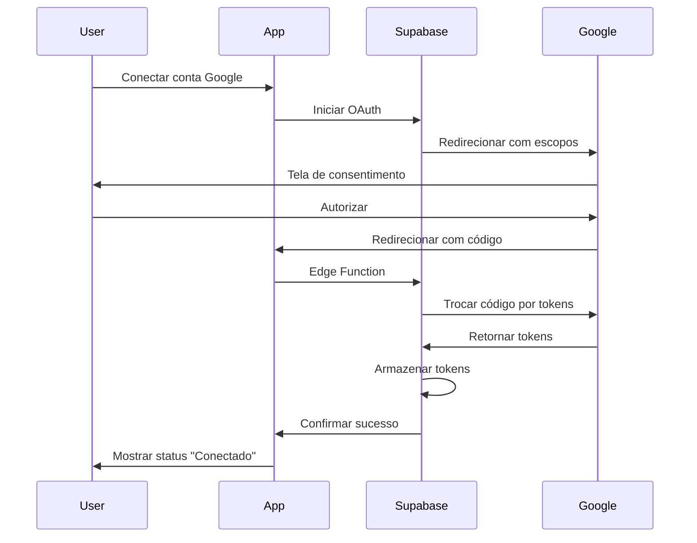

# Google Workspace Integration Documentation

Esta documentação descreve a integração dos serviços do Google Workspace dentro do Super Intellect Companion AI.

## Visão Geral

A integração com o Google Workspace permite que o usuário interaja com os seguintes serviços diretamente pelo chat:

- **Google Calendar** - Criar e gerenciar eventos
- **Google Sheets** - Ler e escrever dados em planilhas
- **Google Docs** - Criar e atualizar documentos
- **Google Drive** - Fazer upload de arquivos e gerenciar pastas
- **Gmail** - Enviar e-mails

## Comandos no Chat

A integração utiliza comandos prefixados com `@` no chat:

- `@calendar` - Ativa o agente de calendário
- `@sheet` - Ativa o agente de planilhas
- `@doc` - Ativa o agente de documentos
- `@drive` - Ativa o agente de armazenamento
- `@email` - Ativa o agente de e-mail

## Arquitetura

A integração funciona através de vários componentes interconectados:

1. **Interface do Usuário**
   - Autocomplete de comandos `@` na caixa de mensagem
   - Componentes para exibir resultados das operações do Google

2. **Agentes Especializados**
   - CalendarAgent - Gerencia eventos do calendário
   - SheetsAgent - Trabalha com planilhas
   - DocsAgent - Cria e edita documentos
   - DriveAgent - Gerencia arquivos e pastas
   - EmailAgent - Envia e-mails

3. **Edge Functions**
   - Funções independentes para cada operação
   - Gerenciamento de tokens OAuth
   - Comunicação segura com as APIs do Google

4. **Orquestrador**
   - Detecta comandos `@` e direciona para o agente apropriado
   - Mantém o contexto da conversa durante interações multiturno

## Fluxo de OAuth

## Escopos OAuth Utilizados

| Serviço | Escopo | Descrição |
|---------|--------|-----------|
| Google Calendar | https://www.googleapis.com/auth/calendar | Acesso total ao calendário |
| Google Sheets | https://www.googleapis.com/auth/spreadsheets | Acesso total às planilhas |
| Google Docs | https://www.googleapis.com/auth/documents | Acesso total aos documentos |
| Google Drive | https://www.googleapis.com/auth/drive | Acesso total aos arquivos |
| Gmail | https://www.googleapis.com/auth/gmail.send | Permissão para enviar e-mails |

## Endpoints das Edge Functions

### Google Calendar

- `google-calendar-create-event` - Cria um novo evento
- `google-calendar-list-events` - Lista eventos em um período

### Google Sheets

- `google-sheets-create` - Cria uma nova planilha
- `google-sheets-read` - Lê dados de uma planilha
- `google-sheets-update` - Atualiza dados em uma planilha

### Google Docs

- `google-docs-create` - Cria um novo documento
- `google-docs-update` - Atualiza um documento existente

### Google Drive

- `google-drive-upload` - Faz upload de um arquivo
- `google-drive-create-folder` - Cria uma nova pasta

### Gmail

- `google-gmail-send` - Envia um e-mail

## System Prompts dos Agentes

Cada agente especializado possui um system prompt dedicado que define seu comportamento, formato de diálogo e validações necessárias. Estes prompts estão configurados no orquestrador e são ativados quando o usuário utiliza o comando @ correspondente.

## Integrações em Tempo Real

A integração inclui suporte a notificações em tempo real através de webhooks e polling periódico, permitindo que o usuário receba atualizações sobre:

- Alterações em documentos compartilhados
- Respostas a convites de calendário
- Novos comentários em arquivos do Drive

## Lidando com Erros

O sistema possui uma estratégia robusta para lidar com erros:

1. **Tokens expirados** - Renovação automática
2. **Permissões insuficientes** - Solicitação de reconexão com escopos adicionais
3. **Limites de API** - Feedback ao usuário sobre limites excedidos
4. **Indisponibilidade temporária** - Retry automático com backoff exponencial

## Armazenamento de Tokens

Os tokens OAuth são armazenados de forma segura no banco de dados Supabase na tabela `user_google_tokens` com acesso controlado por Políticas de Segurança em Nível de Linha (RLS).
