# Documentação Completa do Projeto - Diagramas e Workflows

## Índice

1. [Visão Geral](#visão-geral)
2. [Diagramas de Classe](#diagramas-de-classe)
3. [Diagramas de Caso de Uso](#diagramas-de-caso-de-uso)
4. [Workflows de Funcionamento](#workflows-de-funcionamento)
5. [Workflows por Funcionalidade](#workflows-por-funcionalidade)
6. [Requisitos Funcionais](#requisitos-funcionais)

## Visão Geral

Este projeto implementa uma plataforma avançada de conversa com IA que permite aos usuários interagir com diferentes modelos de inteligência artificial. O sistema possibilita a criação de conversas textuais, bem como a geração de conteúdo multimídia como imagens, vídeos e áudios através de requisições de texto (prompts).

A plataforma é construída usando React com TypeScript para o frontend e Supabase para o backend, incluindo autenticação, banco de dados e armazenamento.

## Diagramas de Classe

### 1. Diagrama de Classes Principais

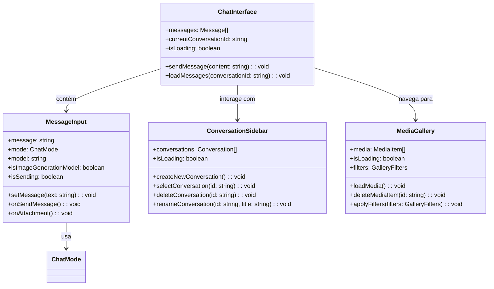

### 2. Diagrama de Classes de Autenticação e Contexto

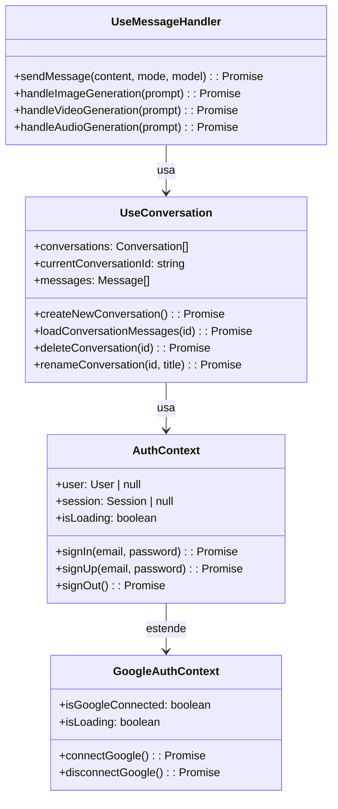

### 3. Diagrama de Classes de Serviços

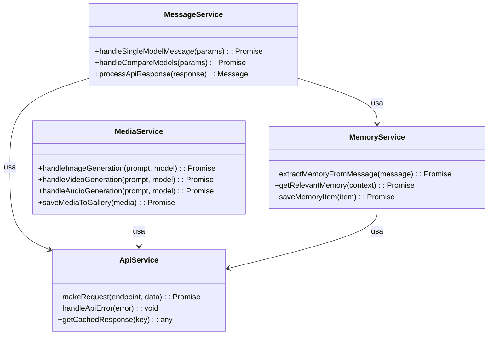

## Diagramas de Caso de Uso

### 1. Caso de Uso Principal - Interação com IA

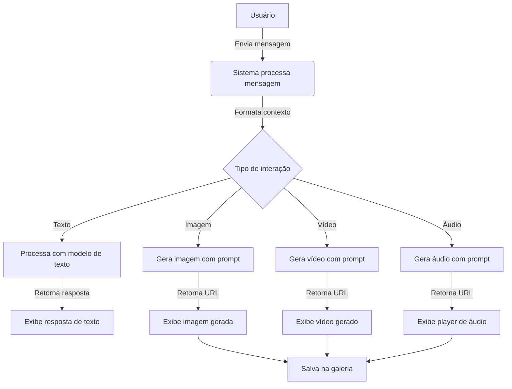

### 2. Caso de Uso - Gerenciamento de Conversas

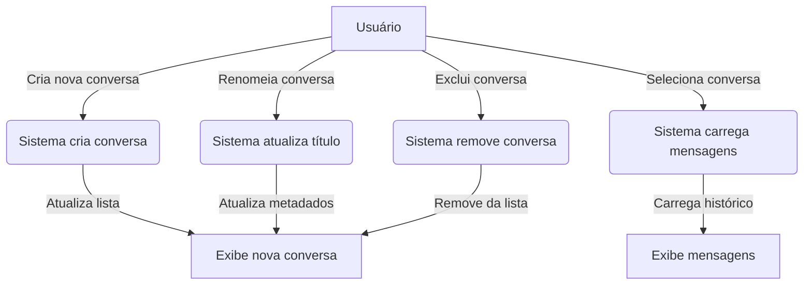

### 3. Caso de Uso - Integração com Google

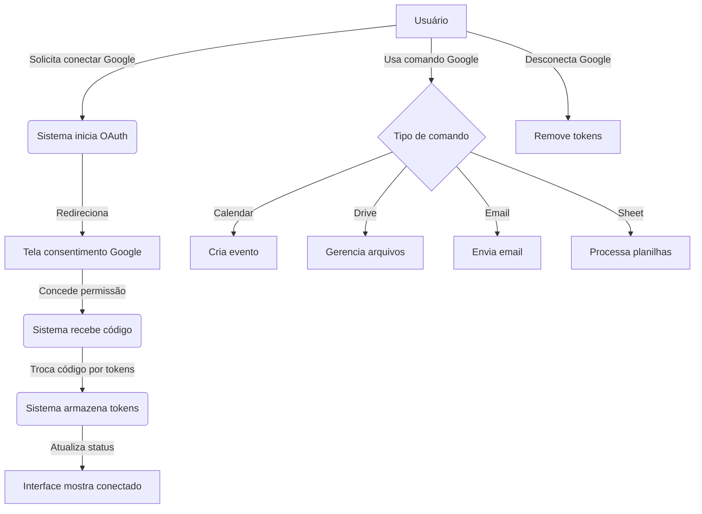

## Workflows de Funcionamento

### Workflow Geral do Sistema

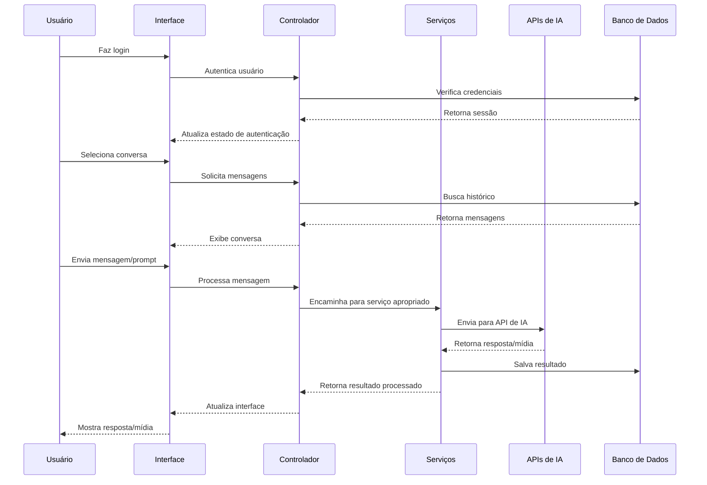

### Workflow de Inicialização da Aplicação

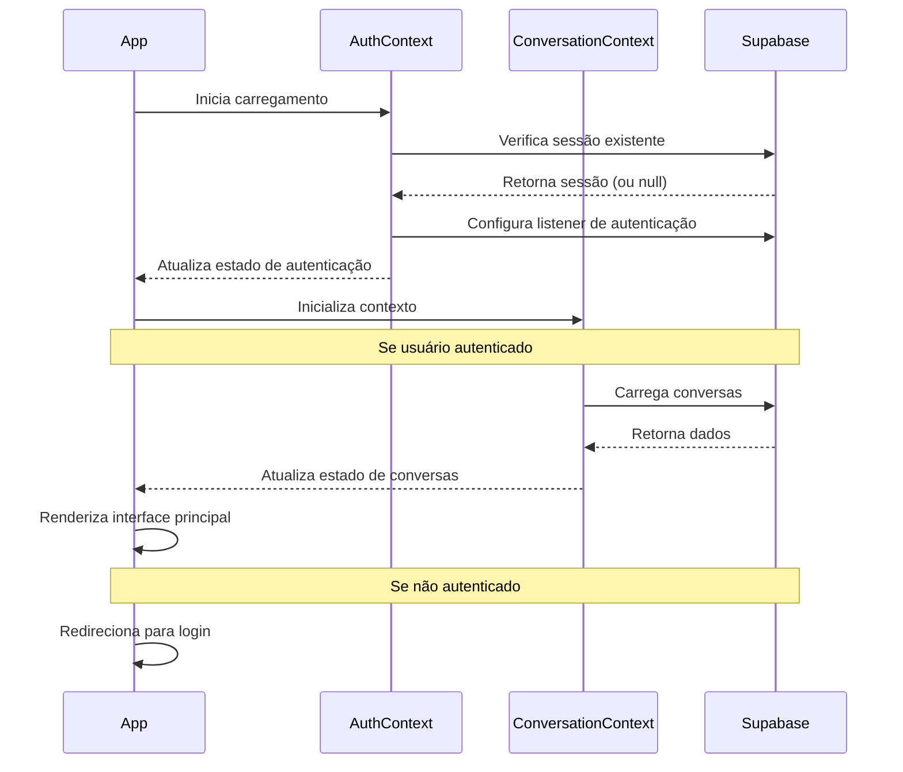

## Workflows por Funcionalidade

### 1. Workflow de Envio de Mensagem de Texto

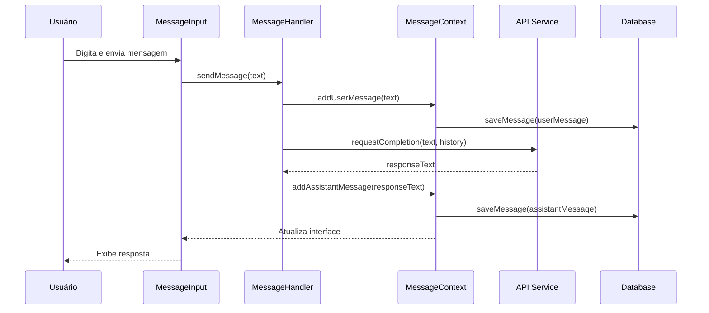

### 2. Workflow de Geração de Imagem

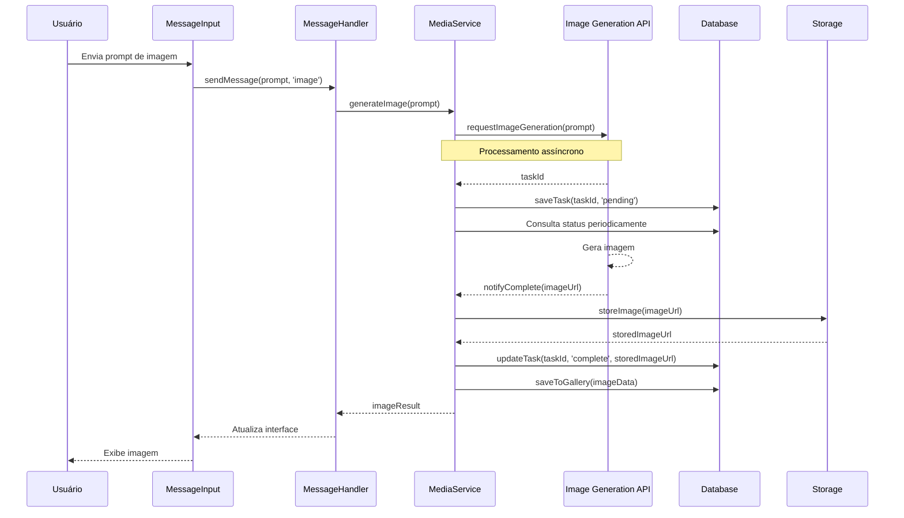

### 3. Workflow de Integração com Google Calendar

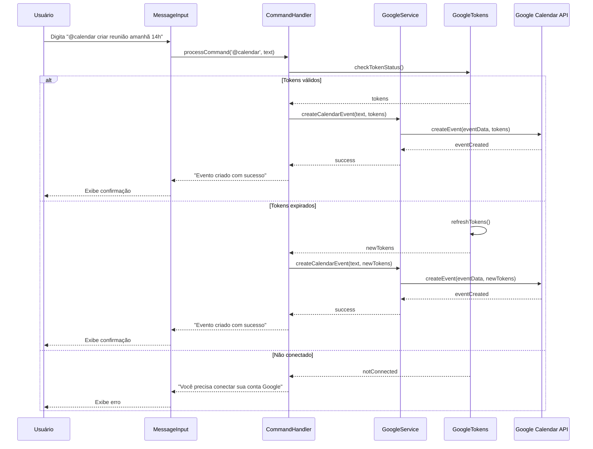

### 4. Workflow de Galeria de Mídia

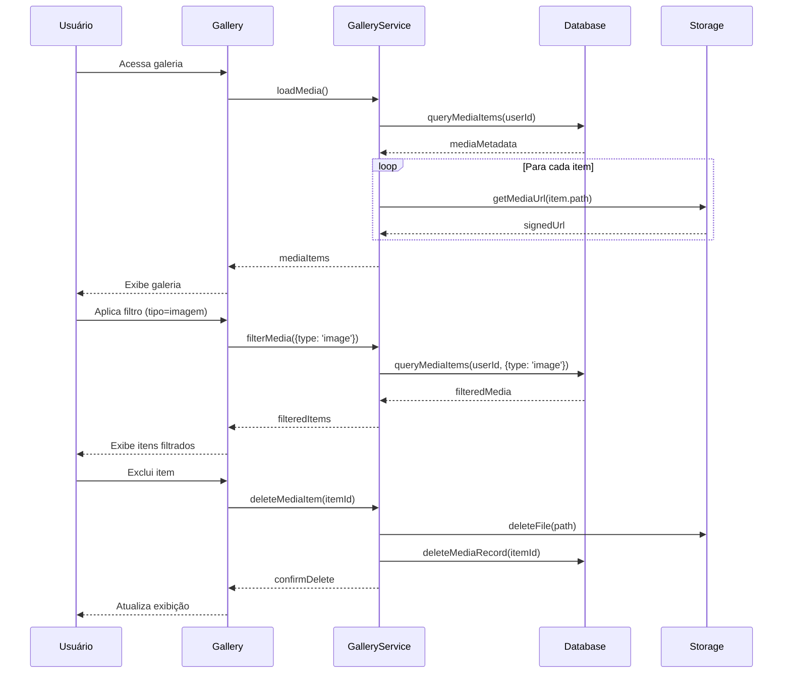

## Requisitos Funcionais

### 1. Sistema de Autenticação
- **RF1.1**: O sistema deve permitir que usuários criem contas com email e senha
- **RF1.2**: O sistema deve permitir autenticação com credenciais salvas
- **RF1.3**: O sistema deve suportar integração com Google via OAuth
- **RF1.4**: O sistema deve permitir que usuários desconectem suas contas vinculadas
- **RF1.5**: O sistema deve manter a sessão dos usuários entre visitas

### 2. Sistema de Conversação
- **RF2.1**: O sistema deve permitir criação de novas conversas
- **RF2.2**: O sistema deve salvar histórico de mensagens por conversa
- **RF2.3**: O sistema deve permitir renomear conversas
- **RF2.4**: O sistema deve permitir excluir conversas
- **RF2.5**: O sistema deve permitir selecionar entre diferentes modelos de IA
- **RF2.6**: O sistema deve permitir comparação entre respostas de modelos diferentes
- **RF2.7**: O sistema deve preservar o contexto da conversa para respostas contextuais

### 3. Sistema de Geração de Mídia
- **RF3.1**: O sistema deve permitir geração de imagens através de prompts
- **RF3.2**: O sistema deve permitir geração de vídeos através de prompts
- **RF3.3**: O sistema deve permitir geração de áudio através de prompts
- **RF3.4**: O sistema deve exibir feedback visual durante geração de mídia
- **RF3.5**: O sistema deve salvar mídia gerada na galeria do usuário
- **RF3.6**: O sistema deve permitir personalização de parâmetros por tipo de mídia
- **RF3.7**: O sistema deve suportar upload de arquivos para processamento

### 4. Sistema de Galeria
- **RF4.1**: O sistema deve exibir mídia gerada pelo usuário
- **RF4.2**: O sistema deve permitir filtragem por tipo de mídia
- **RF4.3**: O sistema deve permitir ordenação por data
- **RF4.4**: O sistema deve permitir exclusão de itens da galeria
- **RF4.5**: O sistema deve permitir download de mídia
- **RF4.6**: O sistema deve exibir detalhes de cada item (prompt, modelo usado)

### 5. Integração com Google
- **RF5.1**: O sistema deve suportar comandos para criar eventos no Google Calendar
- **RF5.2**: O sistema deve suportar comandos para enviar emails via Gmail
- **RF5.3**: O sistema deve suportar comandos para interagir com Google Docs
- **RF5.4**: O sistema deve suportar comandos para interagir com Google Sheets
- **RF5.5**: O sistema deve suportar comandos para gerenciar arquivos no Google Drive
- **RF5.6**: O sistema deve validar permissões antes de acessar serviços Google

### 6. Sistema de Memória
- **RF6.1**: O sistema deve extrair informações relevantes das conversas
- **RF6.2**: O sistema deve usar informações armazenadas para contextualizar respostas
- **RF6.3**: O sistema deve permitir visualização de itens de memória armazenados
- **RF6.4**: O sistema deve permitir exclusão de itens de memória específicos
- **RF6.5**: O sistema deve associar memória ao usuário correto

### 7. Sistema de Gestão de Tokens
- **RF7.1**: O sistema deve controlar o uso de tokens por usuário
- **RF7.2**: O sistema deve exibir saldo de tokens disponível
- **RF7.3**: O sistema deve renovar tokens conforme plano do usuário
- **RF7.4**: O sistema deve permitir aquisição de tokens adicionais
- **RF7.5**: O sistema deve alertar quando o saldo estiver baixo

### 8. Interface e Experiência do Usuário
- **RF8.1**: A interface deve ser responsiva para diferentes dispositivos
- **RF8.2**: O sistema deve fornecer feedback visual para operações em andamento
- **RF8.3**: O sistema deve suportar múltiplos idiomas
- **RF8.4**: O sistema deve ter modo claro e escuro
- **RF8.5**: O sistema deve oferecer opções de acessibilidade
- **RF8.6**: O sistema deve otimizar interações para dispositivos touch (móveis/tablets)
