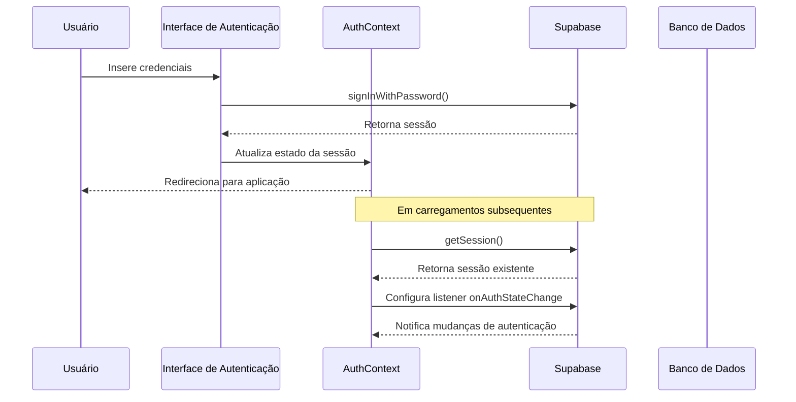
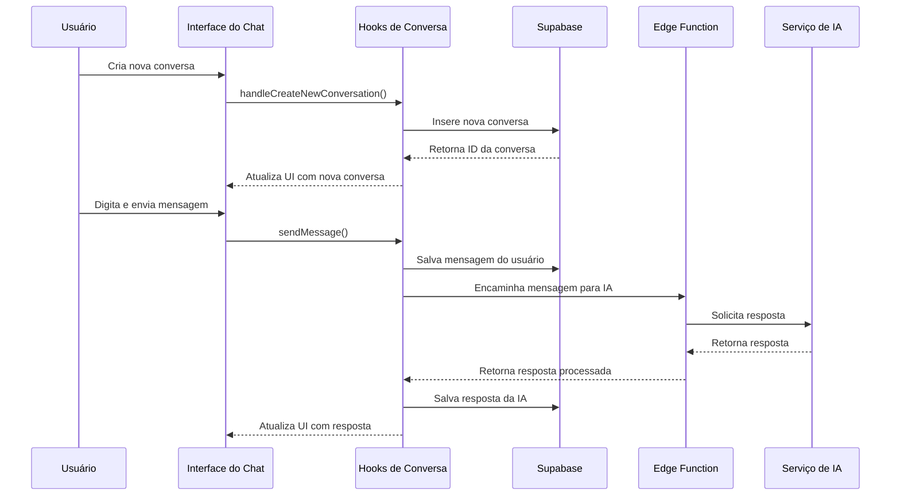
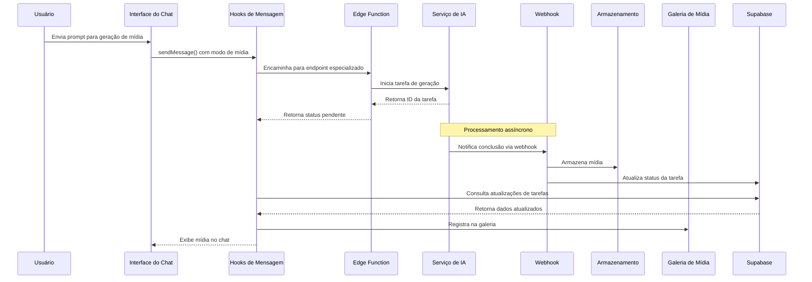
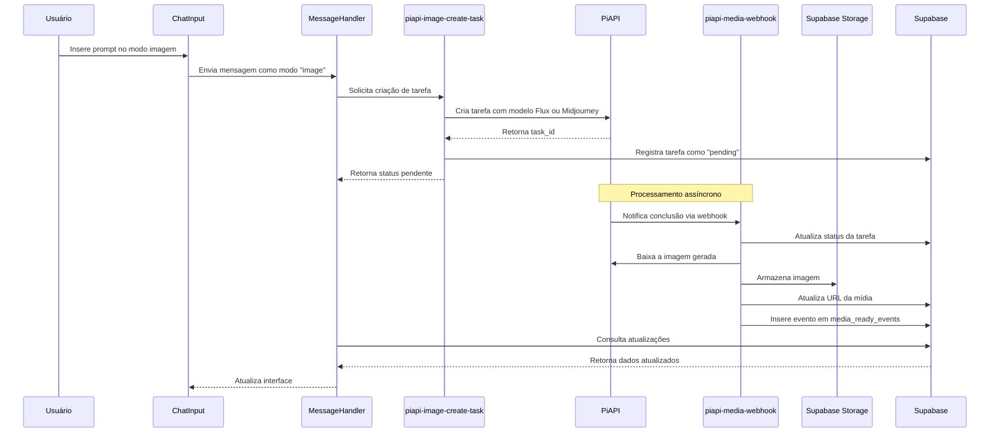
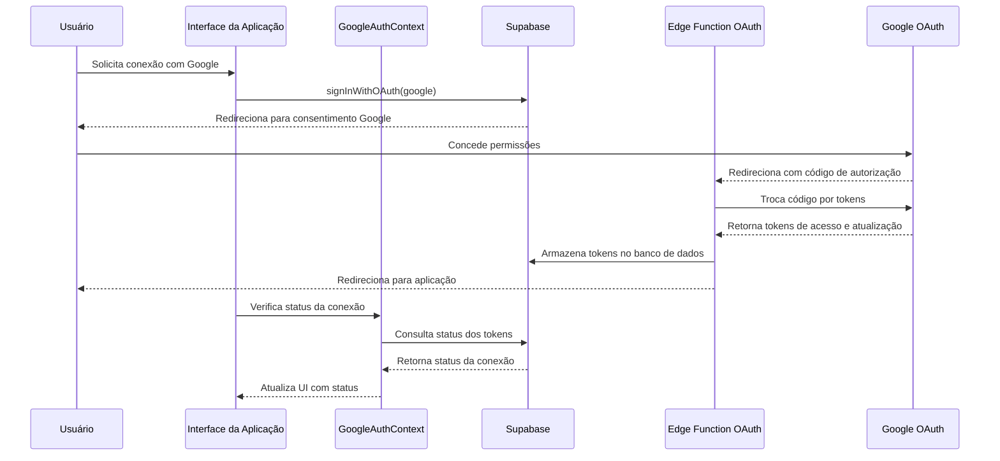

# Documentação Completa do Projeto

## Índice

1. [Visão Geral](#visão-geral)
2. [Arquitetura do Sistema](#arquitetura-do-sistema)
3. [Fluxos de Trabalho (Workflows)](#fluxos-de-trabalho-workflows)
   - [Fluxo de Autenticação](#fluxo-de-autenticação)
   - [Fluxo de Conversação](#fluxo-de-conversação)
   - [Fluxo de Geração de Mídia](#fluxo-de-geração-de-mídia)
   - [Fluxo de Integração com Google](#fluxo-de-integração-com-google)
4. [Componentes Principais](#componentes-principais)
5. [Edge Functions (Funções de Borda)](#edge-functions-funções-de-borda)
6. [Hooks Personalizados](#hooks-personalizados)
7. [Banco de Dados](#banco-de-dados)
8. [Considerações de Segurança](#considerações-de-segurança)
9. [Otimizações de Desempenho](#otimizações-de-desempenho)
10. [Guia de Manutenção](#guia-de-manutenção)

## Visão Geral

Este projeto é uma plataforma avançada de conversa com IA que permite aos usuários interagir com diferentes modelos de inteligência artificial. O sistema possibilita a criação de conversas textuais, bem como a geração de conteúdo multimídia como imagens, vídeos e áudios através de requisições de texto (prompts).

A plataforma utiliza integração com diversos serviços de IA, incluindo:
- Modelos de texto (OpenAI, Anthropic Claude)
- Geração de imagens (Flux, Midjourney via PiAPI)
- Geração de vídeos (Kling, Hunyuan)
- Geração de áudio (MMaudio, DiffRhythm)

O sistema também possui integração com Google e sistema de gerenciamento de tokens para controle de uso.

## Arquitetura do Sistema

A arquitetura do projeto é baseada em React com TypeScript para o frontend, e Supabase para o backend, utilizando:

### Frontend:
- React com TypeScript
- Tailwind CSS para estilização
- shadcn/ui para componentes de interface
- React Router para navegação
- React Query para gerenciamento de estado e requisições

### Backend:
- Supabase para autenticação, banco de dados e armazenamento
- Edge Functions para processamento seguro de requisições a APIs externas
- Webhook para recebimento assíncrono de respostas das APIs de mídia
- Row Level Security para proteção de dados

### Integrações:
- APIs de IA (OpenAI, Anthropic, PiAPI, etc.)
- Google Workspace (via OAuth)
- Serviços de armazenamento (Supabase Storage)

## Fluxos de Trabalho (Workflows)

### Fluxo de Autenticação

**Detalhamento:**
1. O usuário acessa a página de autenticação e insere suas credenciais
2. As credenciais são validadas pelo Supabase Auth
3. Após validação bem-sucedida, um token JWT é gerado
4. O token é armazenado localmente e usado para autenticar requisições subsequentes
5. O contexto de autenticação (AuthContext) é atualizado com os dados do usuário
6. O usuário é redirecionado para a página principal da aplicação

### Fluxo de Conversação

**Detalhamento:**
1. O usuário cria uma nova conversa ou seleciona uma conversa existente
2. O sistema carrega o histórico de mensagens dessa conversa
3. O usuário digita e envia uma mensagem
4. A mensagem é salva no banco de dados e enviada para processamento
5. O contexto da conversa (mensagens anteriores) é considerado na requisição à IA
6. A resposta da IA é recebida, processada e exibida ao usuário
7. A resposta também é salva no banco de dados para histórico

### Fluxo de Geração de Mídia

**Detalhamento:**
1. O usuário envia um prompt para geração de mídia (imagem, vídeo ou áudio)
2. O sistema identifica o tipo de mídia solicitada e o modelo apropriado
3. Uma Edge Function cria uma tarefa na API correspondente (PiAPI, etc.)
4. A tarefa é processada assincronamente pelo serviço de IA
5. Quando concluída, o serviço notifica nosso sistema via webhook
6. O webhook processa a mídia gerada, armazena no Supabase Storage
7. A URL da mídia é registrada no banco de dados e vinculada à mensagem
8. A interface é atualizada para exibir a mídia gerada

#### Fluxo Específico para Geração de Imagens (PiAPI)

**Detalhamento:**
1. O usuário seleciona o modo "imagem" e insere um prompt descritivo
2. O sistema determina o modelo a ser usado (Flux-Schnell, Flux-Dev, Midjourney)
3. A Edge Function `piapi-image-create-task` formata a solicitação e envia para a PiAPI
4. A PiAPI inicia o processamento assíncrono e retorna um ID de tarefa
5. Quando a imagem é gerada, a PiAPI notifica nossa Edge Function `piapi-media-webhook`
6. O webhook baixa a imagem, salva no Storage e atualiza o banco de dados
7. A interface do usuário é atualizada para exibir a imagem gerada

### Fluxo de Integração com Google

**Detalhamento:**
1. O usuário solicita integração com o Google
2. O sistema inicia o fluxo OAuth redirecionando para a tela de consentimento
3. O usuário autoriza o acesso aos serviços solicitados
4. Google retorna um código de autorização
5. Nossa Edge Function troca esse código por tokens de acesso e renovação
6. Os tokens são armazenados de forma segura no banco de dados
7. O sistema pode agora acessar serviços do Google em nome do usuário

## Componentes Principais

### Interface de Conversa

#### ChatInterface
Componente principal da interface de chat, responsável por:
- Exibir a lista de mensagens
- Gerenciar estados de carregamento
- Coordenar interações entre componentes filho

#### ConversationSidebar
Barra lateral que exibe as conversas do usuário e permite:
- Criar novas conversas
- Selecionar conversas existentes
- Renomear ou excluir conversas

#### ChatInput
Campo de entrada para mensagens do usuário com:
- Seleção de modo (texto, imagem, vídeo, áudio)
- Seleção de modelo de IA
- Upload de arquivos

#### ChatMessage
Exibe mensagens individuais com:
- Formatação de texto
- Renderização de conteúdo multimídia
- Indicadores de carregamento

### Galeria de Mídia

#### MediaGallery
Página dedicada à visualização de mídias geradas com:
- Filtros por tipo de mídia
- Exibição em grade
- Opções de download e exclusão

#### GalleryMediaCard
Componente para exibição de item individual da galeria com:
- Pré-visualização de mídia
- Metadados do item
- Opções de interação

## Edge Functions (Funções de Borda)

### piapi-image-create-task
**Propósito:** Criar tarefas de geração de imagens na PiAPI.
**Funcionalidades:**
- Validação de entrada (prompt, modelo, parâmetros)
- Formatação da requisição para PiAPI
- Configuração de webhook para notificações
- Armazenamento de metadados da tarefa no banco de dados

**Workflow Detalhado:**
1. Recebe requisição com prompt, modelo e parâmetros
2. Valida a presença de API key e dados necessários
3. Formata o corpo da requisição conforme o modelo selecionado
4. Configura webhook para receber notificação de conclusão
5. Envia requisição para PiAPI
6. Registra metadados da tarefa no banco de dados
7. Retorna ID da tarefa e status para o cliente

### piapi-video-create-task
**Propósito:** Criar tarefas de geração de vídeos na PiAPI.
**Funcionalidades:**
- Suporte a múltiplos modelos (Kling, Hunyuan, Hailuo)
- Opções de text-to-video e image-to-video
- Configuração de parâmetros como duração e proporção

**Workflow Detalhado:**
1. Recebe prompt e/ou URL de imagem, modelo e parâmetros
2. Valida os dados de entrada conforme requisitos do modelo
3. Formata requisição específica para o modelo selecionado
4. Configura webhook para notificação
5. Envia requisição para PiAPI
6. Registra tarefa no banco de dados
7. Retorna status para o cliente

### piapi-audio-create-task
**Propósito:** Criar tarefas de geração de áudio na PiAPI.
**Funcionalidades:**
- Suporte a modelos de conversão texto-áudio
- Opção de video-to-audio
- Personalização de duração e estilo

**Workflow Detalhado:**
1. Recebe prompt ou URL de vídeo, modelo e parâmetros
2. Valida os dados de entrada conforme requisitos do modelo
3. Formata requisição para o modelo específico
4. Configura webhook para notificação
5. Envia requisição para PiAPI
6. Registra tarefa no banco de dados
7. Retorna status para o cliente

### piapi-media-webhook
**Propósito:** Processar notificações de conclusão de tarefas de mídia.
**Funcionalidades:**
- Recebimento de notificações de conclusão
- Download de mídia gerada
- Armazenamento no Supabase Storage
- Atualização de registros no banco de dados

**Workflow Detalhado:**
1. Recebe notificação com task_id, status e resultado
2. Busca metadados da tarefa no banco de dados
3. Atualiza status da tarefa
4. Se concluída com sucesso, baixa a mídia da URL fornecida
5. Determina o tipo de arquivo e extensão adequada
6. Armazena no bucket apropriado do Storage
7. Atualiza registro com URL pública da mídia
8. Cria evento de notificação para atualização da interface

### piapi-task-status
**Propósito:** Consultar status de tarefas em andamento.
**Funcionalidades:**
- Obtenção de informações detalhadas sobre tarefas
- Verificação em banco de dados local ou API
- Suporte a múltiplos provedores (PiAPI, Midjourney)

**Workflow Detalhado:**
1. Recebe ID da tarefa
2. Verifica se a tarefa existe no banco de dados local
3. Se não existir, consulta diretamente nas APIs configuradas
4. Retorna status detalhado e metadados da tarefa
5. Em caso de erro, fornece informações para depuração

### piapi-task-cancel
**Propósito:** Cancelar tarefas em andamento.
**Funcionalidades:**
- Cancelamento de tarefas em processamento
- Marcação de status no banco de dados
- Tentativa em múltiplos provedores

**Workflow Detalhado:**
1. Recebe ID da tarefa a ser cancelada
2. Envia requisição de cancelamento para PiAPI
3. Se falhar e MJ_API_KEY estiver configurada, tenta cancelar via Midjourney API
4. Atualiza status da tarefa para "cancelled" no banco de dados
5. Retorna resultado da operação

## Hooks Personalizados

### useConversation
**Propósito:** Gerenciar o estado e operações de conversas.
**Funcionalidades:**
- Carregamento, criação, exclusão e renomeação de conversas
- Gerenciamento de mensagens dentro de conversas
- Integração com navegação baseada em URL

**Workflow Detalhado:**
1. Inicializa estado de conversas e mensagens
2. Carrega conversas do usuário
3. Configura efeitos para carregar mensagens quando a conversa muda
4. Fornece métodos para todas as operações CRUD de conversas e mensagens
5. Gerencia estados de carregamento e erro
6. Coordena atualizações de UI e navegação

### useMessageHandler
**Propósito:** Processar envio e recebimento de mensagens.
**Funcionalidades:**
- Envio de mensagens para diferentes modelos de IA
- Gerenciamento de uploads de arquivos
- Integração com múltiplos serviços de IA
- Suporte a comparação de modelos

**Workflow Detalhado:**
1. Recebe conteúdo da mensagem, modo e modelo selecionado
2. Verifica comandos especiais (ex: Google)
3. Constrói contexto da conversa com histórico relevante
4. Envia mensagem para processamento adequado
5. Atualiza interface com resposta recebida
6. Gerencia uploads de arquivos e anexos
7. Trata modos especiais como comparação de modelos

### useMediaGallery
**Propósito:** Gerenciar a galeria de mídia do usuário.
**Funcionalidades:**
- Carregamento e filtragem de itens de mídia
- Exclusão de itens
- Organização por tipo e data

**Workflow Detalhado:**
1. Carrega itens de mídia do usuário do banco de dados
2. Fornece métodos para filtrar por tipo e data
3. Gerencia estados de carregamento e paginação
4. Implementa funcionalidade de exclusão e atualização

### useApiService
**Propósito:** Centralizar requisições a APIs.
**Funcionalidades:**
- Interface unificada para comunicação com serviços
- Tratamento de erros e retentativas
- Gerenciamento de tokens e autenticação

**Workflow Detalhado:**
1. Recebe parâmetros da requisição (endpoint, dados, etc.)
2. Adiciona headers de autenticação necessários
3. Executa requisição com tratamento de erro
4. Retorna resultado padronizado
5. Gerencia cache de requisições quando apropriado

## Banco de Dados

### Principais Tabelas

#### conversations
Armazena metadados de conversas:
- ID único
- ID do usuário proprietário
- Título
- Timestamps de criação e atualização

#### messages
Armazena mensagens individuais:
- ID único
- ID da conversa
- Remetente (user/assistant)
- Conteúdo
- Modo (texto, imagem, etc.)
- Modelo usado (para respostas de IA)
- URLs de mídia (quando aplicável)
- Timestamps

#### piapi_tasks
Rastreia tarefas de geração de mídia:
- ID da tarefa
- Modelo utilizado
- Prompt
- Status (pending, completed, failed, etc.)
- Tipo de mídia
- Parâmetros utilizados
- Resultado (JSON com metadados)
- URL da mídia gerada

#### media_gallery
Catálogo de mídia gerada:
- ID único
- ID do usuário proprietário
- URL da mídia
- Tipo de mídia
- Prompt utilizado
- Modelo utilizado
- Metadados adicionais
- Timestamp de criação

#### user_tokens
Gerencia uso de tokens pelos usuários:
- ID do usuário
- Tokens restantes
- Tokens utilizados
- Datas de último e próximo reset

## Considerações de Segurança

### Autenticação e Autorização
- Autenticação baseada em JWT via Supabase
- Row Level Security (RLS) para proteção de dados
- Políticas específicas por tabela para controle de acesso

### Gestão de Secrets
- API keys e tokens armazenados como variáveis de ambiente no Supabase
- Tokens do Google armazenados com criptografia
- Sem exposição de secrets no código cliente

### Proteção de Dados
- Validação de entrada em todas as funções
- Sanitização de dados antes de armazenamento
- Políticas de controle de acesso por usuário

## Otimizações de Desempenho

### Carregamento Eficiente
- Carregamento sob demanda para conversas e mensagens
- Prevenção de múltiplas requisições simultâneas
- Feedback visual imediato com atualizações otimistas

### Gerenciamento de Estado
- Uso de React Query para cache e gerenciamento de estado
- Memoização para prevenir renderizações desnecessárias
- Estrutura de dados otimizada para operações frequentes

### Mídia
- Lazy loading para conteúdo de mídia
- Dimensionamento e otimização de imagens
- Indicadores de progresso para operações demoradas

## Guia de Manutenção

### Adição de Novos Modelos
1. Identificar capacidades e endpoints do novo modelo
2. Adicionar definição no componente ModelSelector
3. Implementar lógica de formatação na edge function apropriada
4. Testar com requisitos específicos do modelo

### Troubleshooting Comum
- Falhas de geração de mídia: verificar logs da edge function e resposta da API
- Problemas de autenticação: verificar tokens e status da sessão
- Erros de webhook: confirmar configuração da URL e permissões

### Processo de Atualização
1. Realizar alterações em ambiente de desenvolvimento
2. Verificar impacto em funcionalidades existentes
3. Atualizar documentação conforme necessário
4. Implantar com estratégia de rollback disponível
