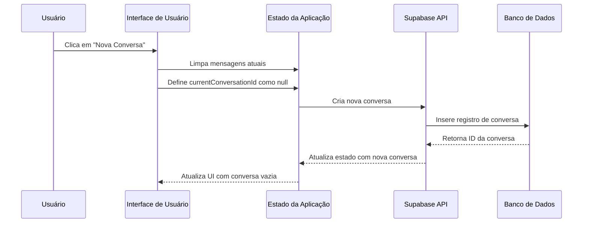
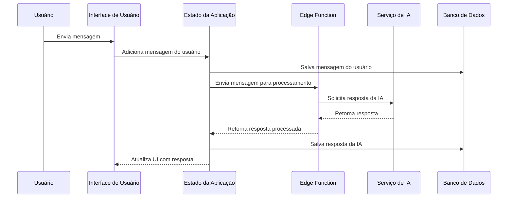
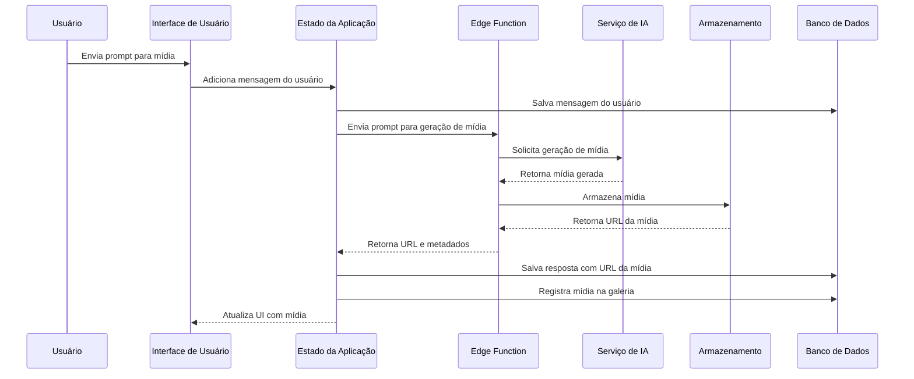
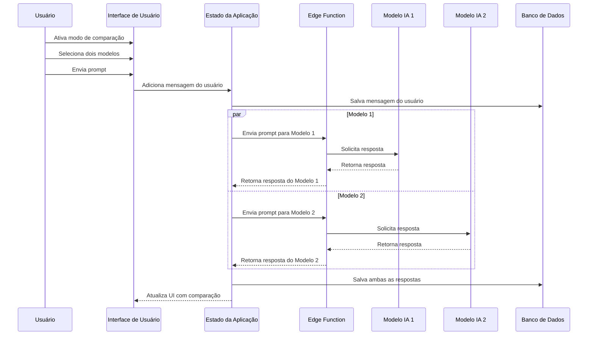
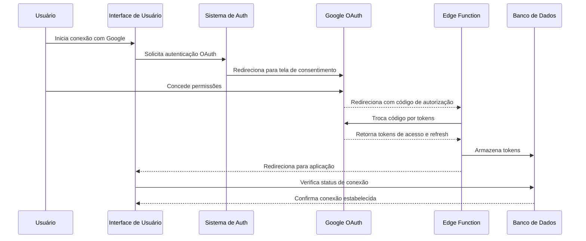

# Documentação Completa do Projeto - Super Intellect Companion AI

## 1. Visão Geral

O Super Intellect Companion AI é uma plataforma avançada de chat com inteligência artificial que permite aos usuários interagir com diversos modelos de IA através de diferentes modalidades, incluindo texto, imagem, vídeo e áudio. A plataforma oferece recursos como autenticação de usuários, gerenciamento de conversas, geração de conteúdo multimodal, sistema de memória, galeria de mídia e integração com serviços Google.

## 2. Arquitetura Técnica

### 2.1. Stack Tecnológico

#### Frontend
- **React**: Biblioteca principal para construção da interface
- **TypeScript**: Linguagem fortemente tipada para melhor qualidade de código
- **Tailwind CSS**: Framework CSS utilitário para estilização
- **shadcn/ui**: Biblioteca de componentes UI acessíveis e consistentes
- **React Router**: Navegação entre páginas
- **Tanstack React Query**: Gerenciamento de estado e requisições de dados
- **Sonner**: Notificações toast

#### Backend
- **Supabase**: Plataforma Backend-as-a-Service que fornece:
  - **Autenticação**: Sistema de autenticação de usuários
  - **Banco de Dados**: PostgreSQL para armazenamento de dados
  - **Edge Functions**: Funções serverless para integrações com APIs
  - **Storage**: Armazenamento de arquivos para mídia gerada

#### Integrações de IA
- **OpenAI**: Modelos GPT para geração de texto (GPT-4, etc.)
- **Anthropic**: Modelos Claude para geração de texto
- **Luma AI**: Geração de vídeo e imagem
- **Eleven Labs**: Geração de áudio
- **Google**: Integração com serviços Google via OAuth

### 2.2. Diagrama de Arquitetura

```
┌───────────────────┐       ┌───────────────────┐
│                   │       │                   │
│  Frontend React   │◄──────┤  Supabase Auth    │
│                   │       │                   │
└─────────┬─────────┘       └───────────────────┘
          │                              ▲
          ▼                              │
┌───────────────────┐       ┌───────────────────┐
│                   │       │                   │
│  Supabase Edge    │◄──────┤  Supabase DB      │
│  Functions        │       │                   │
│                   │       └───────────────────┘
└─────────┬─────────┘
          │
          ▼
┌─────────────────────────────────────────────┐
│                                             │
│             Serviços de IA                  │
│                                             │
│  ┌─────────┐  ┌─────────┐  ┌────────────┐   │
│  │         │  │         │  │            │   │
│  │ OpenAI  │  │ Claude  │  │  Luma AI   │   │
│  │         │  │         │  │            │   │
│  └─────────┘  └─────────┘  └────────────┘   │
│                                             │
│  ┌─────────┐  ┌─────────┐                   │
│  │         │  │         │                   │
│  │ Eleven  │  │ Google  │                   │
│  │ Labs    │  │ APIs    │                   │
│  │         │  │         │                   │
│  └─────────┘  └─────────┘                   │
│                                             │
└─────────────────────────────────────────────┘
```

### 2.3. Estrutura de Diretórios Principal

```
src/
├── components/      # Componentes React reutilizáveis
│   ├── ui/          # Componentes de UI básicos (shadcn/ui)
│   ├── conversation/# Componentes relacionados às conversas
│   └── chat/        # Componentes relacionados à interface de chat
├── contexts/        # Contextos React para estado global
├── hooks/           # Hooks personalizados
├── services/        # Serviços para comunicação com APIs
├── types/           # Definições de tipos TypeScript
├── utils/           # Funções utilitárias
├── pages/           # Componentes de página
├── integrations/    # Integrações com serviços externos
└── docs/            # Documentação do projeto
```

## 3. Sistema de Autenticação

### 3.1. Fluxo de Autenticação

#### 3.1.1. Autenticação com Email/Senha

1. Usuário insere email e senha na página Auth
2. Cliente valida os dados de entrada
3. `supabase.auth.signInWithPassword()` é chamado
4. Supabase valida as credenciais e retorna uma sessão
5. A sessão é armazenada e o usuário é redirecionado para a aplicação
6. O estado de autenticação é atualizado em toda a aplicação via `onAuthStateChange`

#### 3.1.2. Autenticação com Google

1. Usuário clica no botão "Entrar com Google"
2. `supabase.auth.signInWithOAuth()` é chamado com o provedor Google
3. Usuário é redirecionado para a tela de consentimento do Google
4. Após o consentimento, o Google redireciona de volta para a aplicação
5. A Edge Function do Supabase processa o callback OAuth
6. Os tokens do Google são armazenados no banco de dados
7. O usuário é redirecionado para a aplicação principal
8. Os contextos Auth e GoogleAuth são atualizados

### 3.2. Componentes e Contextos Principais

- `AuthContext.tsx`: Gerencia o estado de autenticação global
- `GoogleAuthContext.tsx`: Gerencia tokens e permissões do Google
- `Auth.tsx`: Página de autenticação com formulários de login/registro
- `useAuth.ts`: Hook para acesso ao contexto de autenticação
- `useGoogleTokens.ts`: Hook para gerenciar tokens do Google

### 3.3. Tabelas de Banco de Dados Relacionadas

- `auth.users`: Tabela padrão do Supabase para usuários
- `profiles`: Informações estendidas de perfil do usuário
- `user_google_tokens`: Armazena tokens OAuth do Google

## 4. Sistema de Conversação

### 4.1. Fluxo de Conversação

1. Usuário cria uma nova conversa ou seleciona uma existente
2. O sistema carrega mensagens da conversa selecionada
3. Usuário envia uma mensagem com um modo específico (texto, imagem, etc.)
4. Frontend processa a mensagem e a envia para a Edge Function apropriada
5. Edge Function se comunica com o serviço de IA correto
6. A resposta da IA é processada e retornada ao frontend
7. Frontend exibe a resposta e a salva no banco de dados

### 4.2. Modos de Interação com IA

#### 4.2.1. Modo Texto
- **Objetivo**: Gerar respostas textuais a partir de prompts do usuário
- **Modelos**: GPT-4, Claude, etc.
- **Fluxo**:
  1. Usuário envia mensagem de texto
  2. Mensagem enviada para modelo de IA especializado em texto
  3. Resposta de texto é exibida no chat

#### 4.2.2. Modo Imagem
- **Objetivo**: Gerar imagens a partir de descrições textuais
- **Modelos**: DALLE, Midjourney, etc.
- **Fluxo**:
  1. Usuário envia prompt descrevendo a imagem desejada
  2. Prompt enviado para modelo de geração de imagem
  3. Imagem gerada é exibida no chat e salva na galeria

#### 4.2.3. Modo Vídeo
- **Objetivo**: Gerar vídeos a partir de descrições textuais
- **Modelos**: Luma AI, etc.
- **Fluxo**:
  1. Usuário envia prompt descrevendo o vídeo desejado
  2. Prompt enviado para modelo de geração de vídeo
  3. Vídeo gerado é exibido no chat e salvo na galeria

#### 4.2.4. Modo Áudio
- **Objetivo**: Gerar áudio a partir de texto
- **Modelos**: Eleven Labs, etc.
- **Fluxo**:
  1. Usuário envia texto para conversão em áudio
  2. Texto enviado para modelo de síntese de voz
  3. Áudio gerado é exibido no chat e salvo na galeria

### 4.3. Modo de Comparação de Modelos

- **Objetivo**: Comparar respostas de diferentes modelos de IA para o mesmo prompt
- **Fluxo**:
  1. Usuário ativa o modo de comparação e seleciona dois modelos
  2. Usuário envia um prompt único
  3. Sistema envia o prompt para ambos os modelos simultaneamente
  4. Respostas são exibidas lado a lado para comparação

### 4.4. Componentes e Hooks Principais

- `ChatInterface.tsx`: Interface principal de chat
- `ChatInput.tsx`: Componente de entrada para envio de mensagens
- `ChatMessage.tsx`: Exibe mensagens individuais no chat
- `ConversationSidebar.tsx`: Barra lateral com lista de conversas
- `useConversation.ts`: Hook principal para gerenciamento de conversas
- `useMessageHandler.ts`: Processa e envia mensagens
- `useApiService.ts`: Comunica-se com as Edge Functions

### 4.5. Tabelas de Banco de Dados Relacionadas

- `conversations`: Armazena metadados das conversas
- `messages`: Armazena mensagens individuais
- `user_tokens`: Gerencia o consumo de tokens

## 5. Sistema de Memória

### 5.1. Fluxo do Sistema de Memória

1. Usuário envia mensagens durante conversas
2. Sistema extrai automaticamente informações relevantes
3. Informações são armazenadas como itens de memória
4. Em conversas futuras, memórias relevantes são incluídas como contexto
5. Usuário pode visualizar, editar e excluir itens de memória manualmente

### 5.2. Componentes e Serviços Principais

- `MemoryManager.tsx`: Interface para gerenciar memórias
- `UserMemory.tsx`: Página para visualizar e gerenciar memórias
- `memoryService.ts`: Serviço para operações de memória
- `contentAnalysisService.ts`: Analisa conteúdo para extração de memória
- `useUserMemory.ts`: Hook para acesso ao sistema de memória

### 5.3. Tabelas de Banco de Dados Relacionadas

- `user_memory`: Armazena itens de memória do usuário

## 6. Galeria de Mídia

### 6.1. Fluxo da Galeria de Mídia

1. Mídia é gerada através de interações com IA (imagens, vídeos, áudios)
2. Sistema salva a mídia e seus metadados no banco de dados
3. Usuário pode acessar a galeria para visualizar todo conteúdo gerado
4. Usuário pode filtrar por tipo de mídia, data, etc.
5. Usuário pode visualizar detalhes, baixar ou excluir itens

### 6.2. Componentes Principais

- `MediaGallery.tsx`: Página principal da galeria
- `GalleryFilters.tsx`: Filtros para a galeria
- `GalleryList.tsx`: Lista de itens da galeria
- `GalleryMediaCard.tsx`: Card individual para cada item de mídia
- `useMediaGallery.ts`: Hook para operações da galeria

### 6.3. Tabelas de Banco de Dados Relacionadas

- `media_gallery`: Armazena metadados e URLs de mídia gerada

## 7. Sistema de Tokens

### 7.1. Fluxo do Sistema de Tokens

1. Usuários recebem uma alocação mensal de tokens
2. Tokens são consumidos com base nas operações de IA
3. Sistema verifica saldo de tokens antes de processar requisições
4. Tokens são automaticamente repostos em um cronograma mensal
5. Usuários podem comprar tokens adicionais (se implementado)

### 7.2. Componentes Principais

- `TokenDisplay.tsx`: Exibe o saldo de tokens
- `TokenUsageChart.tsx`: Visualiza o uso de tokens ao longo do tempo
- `TokenPurchaseDialog.tsx`: Diálogo para compra de tokens
- `TokensPlans.tsx`: Página para visualizar planos de tokens

### 7.3. Tabelas de Banco de Dados Relacionadas

- `user_tokens`: Armazena saldo e uso de tokens
- `token_consumption_rates`: Define taxas de consumo por modelo/modo

## 8. Integração com Google

### 8.1. Fluxo de Integração com Google

1. Usuário conecta conta Google através da interface da aplicação
2. Sistema obtém e armazena tokens OAuth
3. Tokens são usados para acessar serviços Google em nome do usuário
4. Sistema gerencia refresh de tokens automaticamente
5. Usuário pode desconectar a conta Google a qualquer momento

### 8.2. Componentes e Serviços Principais

- `GoogleAuthContext.tsx`: Gerencia estado de autenticação Google
- `GoogleIntegrationsPage.tsx`: Página para gerenciar integrações Google
- `useGoogleTokens.ts`: Hook para gerenciar tokens Google
- `googleAuthOperations.ts`: Operações relacionadas à autenticação Google

### 8.3. Edge Functions Relacionadas

- `google-oauth-callback`: Processa callbacks de autenticação Google
- `google-token-refresh`: Atualiza tokens Google expirados
- `google-verify-permissions`: Verifica permissões da conta Google

### 8.4. Tabelas de Banco de Dados Relacionadas

- `user_google_tokens`: Armazena tokens OAuth do Google

## 9. Comunicação com API e Edge Functions

### 9.1. Fluxo de Comunicação com API

1. Frontend faz requisição para Edge Function via `useApiService`
2. Edge Function recebe e valida a requisição
3. Edge Function processa a requisição (pode comunicar-se com APIs externas)
4. Resultado é retornado ao frontend
5. Frontend atualiza a UI com base na resposta

### 9.2. Principais Edge Functions

- `ai-chat`: Função principal para interação com modelos de IA
- `media-storage`: Gerencia armazenamento de mídia
- `memory-extractor`: Extrai memória de mensagens
- `user-tokens`: Gerencia consumo de tokens
- `google-oauth-callback`: Processa callbacks OAuth do Google
- `google-token-refresh`: Atualiza tokens Google

### 9.3. Serviços e Hooks Principais

- `useApiService.ts`: Hook para comunicação com Edge Functions
- `apiRequestService.ts`: Serviço para envio de requisições
- `mediaStorageService.ts`: Serviço para armazenamento de mídia
- `messageService.ts`: Serviço para processamento de mensagens

## 10. Tratamento de Erros e Sistema de Logging

### 10.1. Estratégia de Tratamento de Erros

1. Erros de UI são exibidos como notificações toast
2. Erros de API são logados e retornados ao cliente em formato estruturado
3. Erros críticos são capturados por boundary de erro React
4. Todo o sistema utiliza try-catch para operações assíncronas
5. Estados de erro e carregamento são gerenciados para feedback visual

### 10.2. Sistema de Logging

1. Console logging no frontend para desenvolvimento
2. Logging estruturado nas Edge Functions
3. Erros de serviços externos são capturados e formatados
4. Informações sensíveis são filtradas dos logs

## 11. Requisitos do Sistema

### 11.1. Requisitos de Navegador

- **Chrome**: Versão 80+
- **Firefox**: Versão 78+
- **Safari**: Versão 14+
- **Edge**: Versão 80+

### 11.2. Requisitos de Desempenho

- **Tempo de Resposta**: Respostas de IA em até 5 segundos
- **Responsividade da UI**: Atualizações de interface em até 100ms
- **Usuários Concorrentes**: Suporte para milhares de usuários simultâneos

### 11.3. Requisitos de Confiabilidade

- **Uptime**: Disponibilidade de 99,9%
- **Persistência de Dados**: Sem perda de dados durante operações normais
- **Recuperação de Erros**: Tratamento elegante de falhas de API

## 12. Fluxos de Trabalho Detalhados

### 12.1. Fluxo de Criação de Nova Conversa



### 12.2. Fluxo de Envio de Mensagem



### 12.3. Fluxo de Geração de Mídia



### 12.4. Fluxo de Operação do Modo de Comparação



### 12.5. Fluxo de Integração com Google



## 13. Considerações Futuras e Melhorias

### 13.1. Melhorias Técnicas Potenciais

- Implementação de caching local para melhor desempenho offline
- Paginação de mensagens para conversas muito longas
- Sistema de tags para organização de conversas
- Análise de sentimento e resumo automático de conversas

### 13.2. Expansões Funcionais Potenciais

- Suporte a múltiplos idiomas
- Integração com mais modelos de IA especializados
- Colaboração em tempo real entre múltiplos usuários
- Ferramentas de edição para mídia gerada
- Integração com mais serviços externos (além do Google)

## 14. Conclusão

O Super Intellect Companion AI é uma plataforma robusta e versátil para interação com múltiplos modelos de IA através de diferentes modalidades. A arquitetura modular e o uso de tecnologias modernas permitem uma experiência de usuário fluida e extensível. O sistema de autenticação, conversação, memória, e galeria de mídia trabalham em conjunto para fornecer uma solução completa para geração e gerenciamento de conteúdo baseado em IA.

A documentação acima fornece uma visão abrangente da arquitetura, funcionalidades, fluxos de trabalho e componentes do sistema, servindo como referência para desenvolvimento, manutenção e expansão futura.
