# Documentação Completa do Projeto - Super Intellect Companion AI

## 1. Visão Geral

O Super Intellect Companion AI é uma plataforma avançada de chat com inteligência artificial que permite aos usuários interagir com diversos modelos de IA através de diferentes modalidades, incluindo texto, imagem, vídeo e áudio. A plataforma oferece recursos como autenticação de usuários, gerenciamento de conversas, geração de conteúdo multimodal, sistema de memória, galeria de mídia e integração com serviços Google.

## 2. Arquitetura Técnica

### 2.1. Stack Tecnológico

#### Frontend
- **React**: Biblioteca principal para construção da interface
- **TypeScript**: Linguagem fortemente tipada para melhor qualidade de código
- **Tailwind CSS**: Framework CSS utilitário para estilização
- **shadcn/ui**: Biblioteca de componentes UI acessíveis e consistentes
- **React Router**: Navegação entre páginas
- **Tanstack React Query**: Gerenciamento de estado e requisições de dados
- **Sonner**: Notificações toast

#### Backend
- **Supabase**: Plataforma Backend-as-a-Service que fornece:
  - **Autenticação**: Sistema de autenticação de usuários
  - **Banco de Dados**: PostgreSQL para armazenamento de dados
  - **Edge Functions**: Funções serverless para integrações com APIs
  - **Storage**: Armazenamento de arquivos para mídia gerada

#### Integrações de IA
- **OpenAI**: Modelos GPT para geração de texto (GPT-4, etc.)
- **Anthropic**: Modelos Claude para geração de texto
- **Luma AI**: Geração de vídeo e imagem
- **Eleven Labs**: Geração de áudio
- **Google**: Integração com serviços Google via OAuth

### 2.2. Diagrama de Arquitetura

```
┌───────────────────┐       ┌───────────────────┐
│                   │       │                   │
│  Frontend React   │◄──────┤  Supabase Auth    │
│                   │       │                   │
└─────────┬─────────┘       └───────────────────┘
          │                              ▲
          ▼                              │
┌───────────────────┐       ┌───────────────────┐
│                   │       │                   │
│  Supabase Edge    │◄──────┤  Supabase DB      │
│  Functions        │       │                   │
│                   │       └───────────────────┘
└─────────┬─────────┘
          │
          ▼
┌─────────────────────────────────────────────┐
│                                             │
│             Serviços de IA                  │
│                                             │
│  ┌─────────┐  ┌─────────┐  ┌────────────┐   │
│  │         │  │         │  │            │   │
│  │ OpenAI  │  │ Claude  │  │  Luma AI   │   │
│  │         │  │         │  │            │   │
│  └─────────┘  └─────────┘  └────────────┘   │
│                                             │
│  ┌─────────┐  ┌─────────┐                   │
│  │         │  │         │                   │
│  │ Eleven  │  │ Google  │                   │
│  │ Labs    │  │ APIs    │                   │
│  │         │  │         │                   │
│  └─────────┘  └─────────┘                   │
│                                             │
└─────────────────────────────────────────────┘
```

### 2.3. Estrutura de Diretórios Principal

```
src/
├── components/      # Componentes React reutilizáveis
│   ├── ui/          # Componentes de UI básicos (shadcn/ui)
│   ├── conversation/# Componentes relacionados às conversas
│   └── chat/        # Componentes relacionados à interface de chat
├── contexts/        # Contextos React para estado global
├── hooks/           # Hooks personalizados
├── services/        # Serviços para comunicação com APIs
├── types/           # Definições de tipos TypeScript
├── utils/           # Funções utilitárias
├── pages/           # Componentes de página
├── integrations/    # Integrações com serviços externos
└── docs/            # Documentação do projeto
```

### 2.4. Camada de Integração Google Workspace

Para desacoplar a lógica específica das APIs Google e escalar independentemente do core da aplicação, adicionamos uma camada dedicada composta por:

- **Google Integration Gateway (Edge Function)** – roteia requisições `@calendar`, `@sheet`, `@doc`, aplica cooldowns e verifica quotas.
- **Google Worker (Deno/Node)** – processa chamadas REST do Google, gerencia back‑off exponencial e publica resultados via supabase.realtime.
- **Token Refresh Scheduler** – job `pg_cron` que renova tokens cujo `expires_at` ocorrerá em < 5 min.
- **Webhook Listener** (futuro) – assina notificações push do Google Calendar/Drive para sincronização bidirecional.

```
Frontend ⇆ SSE ⇆ BFF ⇆ Google Gateway → Queue → Google Worker → Google APIs
                                       ↘ (Token Refresh)
```

Este design evita bloqueio da UI, permite retries robustos e mantém observabilidade separada para chamadas Google.

## 3. Sistema de Autenticação

### 3.1. Fluxo de Autenticação

#### 3.1.1. Autenticação com Email/Senha

1. Usuário insere email e senha na página Auth
2. Cliente valida os dados de entrada
3. `supabase.auth.signInWithPassword()` é chamado
4. Supabase valida as credenciais e retorna uma sessão
5. A sessão é armazenada e o usuário é redirecionado para a aplicação
6. O estado de autenticação é atualizado em toda a aplicação via `onAuthStateChange`

#### 3.1.2. Autenticação com Google

1. Usuário clica no botão "Entrar com Google"
2. `supabase.auth.signInWithOAuth()` é chamado com o provedor Google
3. Usuário é redirecionado para a tela de consentimento do Google
4. Após o consentimento, o Google redireciona de volta para a aplicação
5. A Edge Function do Supabase processa o callback OAuth
6. Os tokens do Google são armazenados no banco de dados
7. O usuário é redirecionado para a aplicação principal
8. Os contextos Auth e GoogleAuth são atualizados

### 3.2. Componentes e Contextos Principais

- `AuthContext.tsx`: Gerencia o estado de autenticação global
- `GoogleAuthContext.tsx`: Gerencia tokens e permissões do Google
- `Auth.tsx`: Página de autenticação com formulários de login/registro
- `useAuth.ts`: Hook para acesso ao contexto de autenticação
- `useGoogleTokens.ts`: Hook para gerenciar tokens do Google

### 3.3. Tabelas de Banco de Dados Relacionadas

- `auth.users`: Tabela padrão do Supabase para usuários
- `profiles`: Informações estendidas de perfil do usuário
- `user_google_tokens`: Armazena tokens OAuth do Google

## 4. Sistema de Conversação

### 4.1. Fluxo de Conversação

1. Usuário cria uma nova conversa ou seleciona uma existente
2. O sistema carrega mensagens da conversa selecionada
3. Usuário envia uma mensagem com um modo específico (texto, imagem, etc.)
4. Frontend processa a mensagem e a envia para a Edge Function apropriada
5. Edge Function se comunica com o serviço de IA correto
6. A resposta da IA é processada e retornada ao frontend
7. Frontend exibe a resposta e a salva no banco de dados

### 4.2. Modos de Interação com IA

#### 4.2.1. Modo Texto
- **Objetivo**: Gerar respostas textuais a partir de prompts do usuário
- **Modelos**: GPT-4, Claude, etc.
- **Fluxo**:
  1. Usuário envia mensagem de texto
  2. Mensagem enviada para modelo de IA especializado em texto
  3. Resposta de texto é exibida no chat

#### 4.2.2. Modo Imagem
- **Objetivo**: Gerar imagens a partir de descrições textuais
- **Modelos**: DALLE, Midjourney, etc.
- **Fluxo**:
  1. Usuário envia prompt descrevendo a imagem desejada
  2. Prompt enviado para modelo de geração de imagem
  3. Imagem gerada é exibida no chat e salva na galeria

#### 4.2.3. Modo Vídeo
- **Objetivo**: Gerar vídeos a partir de descrições textuais
- **Modelos**: Luma AI, etc.
- **Fluxo**:
  1. Usuário envia prompt descrevendo o vídeo desejado
  2. Prompt enviado para modelo de geração de vídeo
  3. Vídeo gerado é exibido no chat e salvo na galeria

#### 4.2.4. Modo Áudio
- **Objetivo**: Gerar áudio a partir de texto
- **Modelos**: Eleven Labs, etc.
- **Fluxo**:
  1. Usuário envia texto para conversão em áudio
  2. Texto enviado para modelo de síntese de voz
  3. Áudio gerado é exibido no chat e salvo na galeria

### 4.3. Modo de Comparação de Modelos

- **Objetivo**: Comparar respostas de diferentes modelos de IA para o mesmo prompt
- **Fluxo**:
  1. Usuário ativa o modo de comparação e seleciona dois modelos
  2. Usuário envia um prompt único
  3. Sistema envia o prompt para ambos os modelos simultaneamente
  4. Respostas são exibidas lado a lado para comparação

### 4.4. Componentes e Hooks Principais

- `ChatInterface.tsx`: Interface principal de chat
- `ChatInput.tsx`: Componente de entrada para envio de mensagens
- `ChatMessage.tsx`: Exibe mensagens individuais no chat
- `ConversationSidebar.tsx`: Barra lateral com lista de conversas
- `useConversation.ts`: Hook principal para gerenciamento de conversas
- `useMessageHandler.ts`: Processa e envia mensagens
- `useApiService.ts`: Comunica-se com as Edge Functions

### 4.5. Tabelas de Banco de Dados Relacionadas

- `conversations`: Armazena metadados das conversas
- `messages`: Armazena mensagens individuais
- `user_tokens`: Gerencia o consumo de tokens

## 5. Sistema de Memória

### 5.1. Fluxo do Sistema de Memória

1. Usuário envia mensagens durante conversas
2. Sistema extrai automaticamente informações relevantes
3. Informações são armazenadas como itens de memória
4. Em conversas futuras, memórias relevantes são incluídas como contexto
5. Usuário pode visualizar, editar e excluir itens de memória manualmente

### 5.2. Componentes e Serviços Principais

- `MemoryManager.tsx`: Interface para gerenciar memórias
- `UserMemory.tsx`: Página para visualizar e gerenciar memórias
- `memoryService.ts`: Serviço para operações de memória
- `contentAnalysisService.ts`: Analisa conteúdo para extração de memória
- `useUserMemory.ts`: Hook para acesso ao sistema de memória

### 5.3. Tabelas de Banco de Dados Relacionadas

- `user_memory`: Armazena itens de memória do usuário

## 6. Galeria de Mídia

### 6.1. Fluxo da Galeria de Mídia

1. Mídia é gerada através de interações com IA (imagens, vídeos, áudios)
2. Sistema salva a mídia e seus metadados no banco de dados
3. Usuário pode acessar a galeria para visualizar todo conteúdo gerado
4. Usuário pode filtrar por tipo de mídia, data, etc.
5. Usuário pode visualizar detalhes, baixar ou excluir itens

### 6.2. Componentes Principais

- `MediaGallery.tsx`: Página principal da galeria
- `GalleryFilters.tsx`: Filtros para a galeria
- `GalleryList.tsx`: Lista de itens da galeria
- `GalleryMediaCard.tsx`: Card individual para cada item de mídia
- `useMediaGallery.ts`: Hook para operações da galeria

### 6.3. Tabelas de Banco de Dados Relacionadas

- `media_gallery`: Armazena metadados e URLs de mídia gerada

## 7. Sistema de Tokens

### 7.1. Fluxo do Sistema de Tokens

1. Usuários recebem uma alocação mensal de tokens
2. Tokens são consumidos com base nas operações de IA
3. Sistema verifica saldo de tokens antes de processar requisições
4. Tokens são automaticamente repostos em um cronograma mensal
5. Usuários podem comprar tokens adicionais (se implementado)

### 7.2. Componentes Principais

- `TokenDisplay.tsx`: Exibe o saldo de tokens
- `TokenUsageChart.tsx`: Visualiza o uso de tokens ao longo do tempo
- `TokenPurchaseDialog.tsx`: Diálogo para compra de tokens
- `TokensPlans.tsx`: Página para visualizar planos de tokens

### 7.3. Tabelas de Banco de Dados Relacionadas

- `user_tokens`: Armazena saldo e uso de tokens
- `token_consumption_rates`: Define taxas de consumo por modelo/modo

## 8. Integração com Google Workspace (Gateway + Workers)

A camada Google Workspace foi reforçada para garantir **persistência robusta de tokens** e **verificação de permissões em tempo real**, evitando o problema de "não autorizado" após login.

### 8.1. Fluxo de Autorização End‑to‑End

1. **OAuth Sign‑in**  – `supabase.auth.signInWithOAuth('google')` redireciona para a tela de consentimento.
2. **Edge Function `/google-oauth-callback`**
   1. Troca o `code` por `access_token`, `refresh_token`, `expires_in`.
   2. **Decodifica `scope`** retornado pelo Google e grava em coluna **`scopes TEXT[]`**.
   3. Insere (ou upserta) registro em `user_google_tokens` usando uma *Service Role* para bypassar RLS.
3. **Persistência / RLS**
   ```sql
   ALTER TABLE public.user_google_tokens
     ADD COLUMN scopes TEXT[] NOT NULL DEFAULT '{}';

   -- Cada usuário só enxerga seus tokens
   CREATE POLICY "Tokens are private" ON public.user_google_tokens
     USING (user_id = auth.uid());
   ```
4. **Token Manager (Gateway)**
   - Para cada requisição `@calendar/@sheet/@doc`, carrega tokens + scopes.
   - Se `expires_at < now() + INTERVAL '3 min'` → chama `/google-token-refresh` antes de prosseguir.
   - Se escopos necessários não estão em `scopes` → retorna erro `MISSING_SCOPE`, o frontend orienta o usuário a reconectar.
5. **Google Worker** executa a chamada REST já com o `access_token` atualizado.
6. **Erro 401 ou 403**
   - Primeiro tenta *refresh* imediato.
   - Persistindo falha → apaga tokens + emite evento `GOOGLE_RECONNECT_REQUIRED` via `supabase.realtime`.

### 8.2. Scheduler de Renovação Proativa

Job **`pg_cron`** roda a cada 15 min:
```sql
SELECT refresh_google_token(user_id)
  FROM user_google_tokens
  WHERE expires_at < extract(epoch FROM now()) + 900;
```
Proc `refresh_google_token()` encapsula a chamada HTTP para `/google-token-refresh`.

### 8.3. Verificação de Permissões (Edge Function `/google-verify-permissions`)

```ts
export default async (req: Request) => {
  const { user_id, required_scopes } = await req.json();
  const { data } = await supabase
    .from('user_google_tokens')
    .select('scopes')
    .eq('user_id', user_id)
    .single();
  const hasAll = required_scopes.every((s: string) => data.scopes.includes(s));
  return Response.json({ authorized: hasAll });
};
```
Frontend/Agents chamam antes de cada ação e, em caso negativo, solicitam reconexão Google ao usuário.

### 8.4. Checklist de Debug

- **Falha ao salvar tokens?** Confirme que a *Service Role key* está sendo usada na função `google-oauth-callback`.
- **Não encontra tokens?** Verifique se RLS policy acima está publicada e `auth.uid()` corresponde ao `user_id` salvo.
- **Erro de escopo insuficiente?** Peça reconexão com scopes adicionais.
- **Tokens expiram rápido?** Garanta que `refresh_token` é pedido com `access_type=offline` e `prompt=consent`.

## 9. Agentes Google Suite (@calendar, @sheet, @doc)

### 9.1. Preambulo de Atualização (System Prompt Comum)

```txt
🚀 ATUALIZAÇÃO DE CAPACIDADES (v‑Google‑Suite)

Você acaba de receber três novas funções via Edge Functions que permitem ao usuário interagir com o Google Workspace:

  • @calendar  →  cria eventos no Google Calendar  
  • @sheet     →  lê ou escreve em planilhas Google Sheets  
  • @doc       →  cria ou atualiza documentos Google Docs  

Padrão de uso:
1. Detecte se a mensagem contém um desses comandos.
2. Adote o papel do agente especializado correspondente.
3. Conduza um diálogo em português para coletar **apenas** os dados indispensáveis.
4. Quando tiver tudo, invoque a *tool* apropriada.  
5. Após a resposta da tool, confirme a ação ao usuário (link + pequeno resumo).

⚠️ Não invente informações, não chame tool sem validar campos e nunca exponha tokens.
```

### 9.2. Fluxo Mult‑Agente

```
Usuário ─► Analyzer ─► ( @calendar ) ─► CalendarAgent ─► create_event tool
                       ( @sheet )    ─► SheetsAgent  ─► sheet_write/read tool
                       ( @doc )      ─► DocsAgent    ─► doc_create/update tool
```

### 9.3. CalendarAgent

**System Prompt (após o preâmbulo):**
```txt
Você é o CalendarAgent. Seu papel é ajudar o usuário a criar eventos no Google Calendar.

1. Verifique se já possui: título (summary), início (start), fim (end), convidados (attendees opcional), descrição opcional.
2. Se faltar algo, faça perguntas curtas até completar tudo.
3. Quando tudo estiver preenchido, chame a tool `create_event`. Aguarde a resposta JSON.
4. Confirme criação ao usuário com link: https://calendar.google.com/calendar/event?eid=<eventId>.
```

**Tool Definition**
```jsonc
{
  "name": "create_event",
  "endpoint": "/google/calendar/createEvent",
  "parameters": {
    "summary": "string",
    "description": "string",
    "start": "date-time",
    "end": "date-time",
    "attendees": ["email"]
  }
}
```

### 9.4. SheetsAgent

System Prompt, tool `sheet_write` / `sheet_read` com campos `spreadsheetId`, `range`, `values`.

### 9.5. DocsAgent

System Prompt, tool `doc_create` / `doc_update` com campos `title`, `contentMarkdown`, `docId`.

### 9.6. Edge Functions (Deno) Necessárias

- `/google/calendar/createEvent.ts`
- `/google/sheets/write.ts`
- `/google/docs/create.ts`

Cada função:
1. Recupera tokens do usuário em `user_google_tokens`.
2. Instancia cliente Google (googleapis.deno.dev).
3. Executa operação solicitada.
4. Retorna JSON com ID/link.

## 10. Comunicação com API e Edge Functions

### 10.1. Fluxo de Comunicação com API

1. Frontend faz requisição para Edge Function via `useApiService`
2. Edge Function recebe e valida a requisição
3. Edge Function processa a requisição (pode comunicar-se com APIs externas)
4. Resultado é retornado ao frontend
5. Frontend atualiza a UI com base na resposta

### 10.2. Principais Edge Functions

- `ai-chat`: Função principal para interação com modelos de IA
- `media-storage`: Gerencia armazenamento de mídia
- `memory-extractor`: Extrai memória de mensagens
- `user-tokens`: Gerencia consumo de tokens
- `google-oauth-callback`: Processa callbacks OAuth do Google
- `google-token-refresh`: Atualiza tokens Google
- `google/calendar/createEvent`: Cria eventos no Google Calendar
- `google/sheets/write`: Escreve em planilhas do Google Sheets
- `google/docs/create`: Cria documentos no Google Docs

### 10.3. Serviços e Hooks Principais

- `useApiService.ts`: Hook para comunicação com Edge Functions
- `apiRequestService.ts`: Serviço para envio de requisições
- `mediaStorageService.ts`: Serviço para armazenamento de mídia
- `messageService.ts`: Serviço para processamento de mensagens

## 11. Tratamento de Erros e Sistema de Logging

### 11.1. Estratégia de Tratamento de Erros

1. Erros de UI são exibidos como notificações toast
2. Erros de API são logados e retornados ao cliente em formato estruturado
3. Erros críticos são capturados por boundary de erro React
4. Todo o sistema utiliza try-catch para operações assíncronas
5. Estados de erro e carregamento são gerenciados para feedback visual
6. Erros específicos das APIs Google têm tratamento especializado:
   - `MISSING_SCOPE`: Solicita ao usuário reconectar com permissões adicionais
   - `TOKEN_EXPIRED`: Tenta refresh automático, ou solicita reconexão
   - `QUOTA_EXCEEDED`: Informa limite de API atingido e sugere tentar mais tarde

### 11.2. Sistema de Logging

1. Console logging no frontend para desenvolvimento
2. Logging estruturado nas Edge Functions
3. Erros de serviços externos são capturados e formatados
4. Informações sensíveis são filtradas dos logs

## 12. Requisitos do Sistema

### 12.1. Requisitos de Navegador

- **Chrome**: Versão 80+
- **Firefox**: Versão 78+
- **Safari**: Versão 14+
- **Edge**: Versão 80+

### 12.2. Requisitos de Desempenho

- **Tempo de Resposta**: Respostas de IA em até 5 segundos
- **Responsividade da UI**: Atualizações de interface em até 100ms
- **Usuários Concorrentes**: Suporte para milhares de usuários simultâneos

### 12.3. Requisitos de Confiabilidade

- **Uptime**: Disponibilidade de 99,9%
- **Persistência de Dados**: Sem perda de dados durante operações normais
- **Recuperação de Erros**: Tratamento elegante de falhas de API

## 13. Fluxos de Trabalho Detalhados

### 13.1. Fluxo de Criação de Nova Conversa

```mermaid
sequenceDiagram
    participant User as Usuário
    participant UI as Interface de Usuário
    participant State as Estado da Aplicação
    participant API as Supabase API
    participant DB as Banco de Dados
    
    User->>UI: Clica em "Nova Conversa"
    UI->>State: Limpa mensagens atuais
    UI->>State: Define currentConversationId como null
    State->>API: Cria nova conversa
    API->>DB: Insere registro de conversa
    DB-->>API: Retorna ID da conversa
    API-->>State: Atualiza estado com nova conversa
    State-->>UI: Atualiza UI com conversa vazia
```



### 13.2. Fluxo de Envio de Mensagem

```mermaid
sequenceDiagram
    participant User as Usuário
    participant UI as Interface de Usuário
    participant State as Estado da Aplicação
    participant API as Edge Function
    participant AI as Serviço de IA
    participant DB as Banco de Dados
    
    User->>UI: Envia mensagem
    UI->>State: Adiciona mensagem do usuário
    State->>DB: Salva mensagem do usuário
    State->>API: Envia mensagem para processamento
    API->>AI: Solicita resposta da IA
    AI-->>API: Retorna resposta
    API-->>State: Retorna resposta processada
    State->>DB: Salva resposta da IA
    State-->>UI: Atualiza UI com resposta
```



### 13.3. Fluxo de Geração de Mídia

```mermaid
sequenceDiagram
    participant User as Usuário
    participant UI as Interface de Usuário
    participant State as Estado da Aplicação
    participant API as Edge Function
    participant AI as Serviço de IA
    participant Storage as Armazenamento
    participant DB as Banco de Dados
    
    User->>UI: Envia prompt para mídia
    UI->>State: Adiciona mensagem do usuário
    State->>DB: Salva mensagem do usuário
    State->>API: Envia prompt para geração de mídia
    API->>AI: Solicita geração de mídia
    AI-->>API: Retorna mídia gerada
    API->>Storage: Armazena mídia
    Storage-->>API: Retorna URL da mídia
    API-->>State: Retorna URL e metadados
    State->>DB: Salva resposta com URL da mídia
    State->>DB: Registra mídia na galeria
    State-->>UI: Atualiza UI com mídia
```



### 13.4. Fluxo de Operação do Modo de Comparação

```mermaid
sequenceDiagram
    participant User as Usuário
    participant UI as Interface de Usuário
    participant State as Estado da Aplicação
    participant API as Edge Function
    participant AI1 as Modelo IA 1
    participant AI2 as Modelo IA 2
    participant DB as Banco de Dados
    
    User->>UI: Ativa modo de comparação
    User->>UI: Seleciona dois modelos
    User->>UI: Envia prompt
    UI->>State: Adiciona mensagem do usuário
    State->>DB: Salva mensagem do usuário
    
    par Modelo 1
        State->>API: Envia prompt para Modelo 1
        API->>AI1: Solicita resposta
        AI1-->>API: Retorna resposta
        API-->>State: Retorna resposta do Modelo 1
    and Modelo 2
        State->>API: Envia prompt para Modelo 2
        API->>AI2: Solicita resposta
        AI2-->>API: Retorna resposta
        API-->>State: Retorna resposta do Modelo 2
    end
    
    State->>DB: Salva ambas as respostas
    State-->>UI: Atualiza UI com comparação
```



### 13.5. Fluxo de Integração com Google

```mermaid
sequenceDiagram
    participant User as Usuário
    participant UI as Interface de Usuário
    participant Auth as Sistema de Auth
    participant Google as Google OAuth
    participant Edge as Edge Function
    participant DB as Banco de Dados
    
    User->>UI: Inicia conexão com Google
    UI->>Auth: Solicita autenticação OAuth
    Auth->>Google: Redireciona para tela de consentimento
    User->>Google: Concede permissões
    Google-->>Edge: Redireciona com código de autorização
    Edge->>Google: Troca código por tokens
    Google-->>Edge: Retorna tokens de acesso e refresh
    Edge->>DB: Armazena tokens
    Edge-->>UI: Redireciona para aplicação
    UI->>DB: Verifica status de conexão
    DB-->>UI: Confirma conexão estabelecida
```



### 13.6. Fluxo de Agentes Google Suite

```mermaid
sequenceDiagram
    participant User as Usuário
    participant UI as Interface
    participant Analyzer as Analyzer
    participant Agent as Agente Google
    participant EF as Edge Function
    participant Google as Google API
    participant DB as Banco de Dados

    User->>UI: Mensagem com @calendar
    UI->>Analyzer: Detecta comando
    Analyzer->>Agent: Roteia para CalendarAgent
    Agent->>User: Pergunta dados faltantes
    User->>Agent: Fornece dados
    Agent->>EF: create_event (summary,start,end...)
    EF->>DB: Busca tokens
    EF->>Google: Cria evento
    Google-->>EF: Retorna eventId
    EF-->>Agent: {"eventId": "abc"}
    Agent-->>User: Confirma evento (link)
```



## 14. Considerações Futuras e Melhorias

### 14.1. Melhorias Técnicas Potenciais

- Implementação de caching local para melhor desempenho offline
- Paginação de mensagens para conversas muito longas
- Sistema de tags para organização de conversas
- Análise de sentimento e resumo automático de conversas

### 14.2. Expansões Funcionais Potenciais

- Suporte a múltiplos idiomas
- Integração com mais modelos de IA especializados
- Colaboração em tempo real entre múltiplos usuários
- Ferramentas de edição para mídia gerada
- Integração com mais serviços externos (além do Google)
- Suporte a múltiplas contas Google por usuário
- Manipulação de arquivos Google Drive (`@drive` futuro)
- Sincronização bidirecional de eventos

## 15. Conclusão

O Super Intellect Companion AI é uma plataforma robusta e versátil para interação com múltiplos modelos de IA através de diferentes modalidades. A arquitetura modular e o uso de tecnologias modernas permitem uma experiência de usuário fluida e extensível. O sistema de autenticação, conversação, memória, e galeria de mídia trabalham em conjunto para fornecer uma solução completa para geração e gerenciamento de conteúdo baseado em IA.

Com os novos agentes Google Suite, o Super Intellect Companion AI agora permite a criação de eventos, edição de planilhas e geração de documentos diretamente no fluxo de conversa, elevando a produtividade do usuário sem sair da plataforma.

A documentação acima fornece uma visão abrangente da arquitetura, funcionalidades, fluxos de trabalho e componentes do sistema, servindo como referência para desenvolvimento, manutenção e expansão futura.
