# Technical Workflow Documentation

## 1. User Authentication Flow

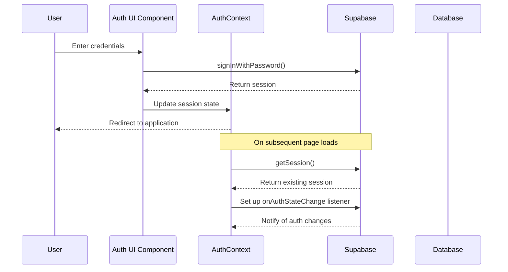

## 2. Conversation Creation and Message Flow

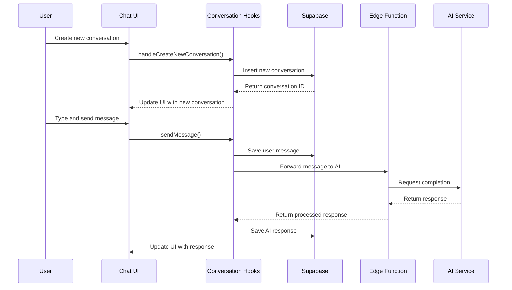

## 3. Media Generation Workflow

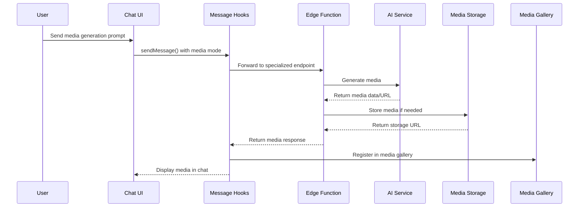

## 4. Google Integration Workflow

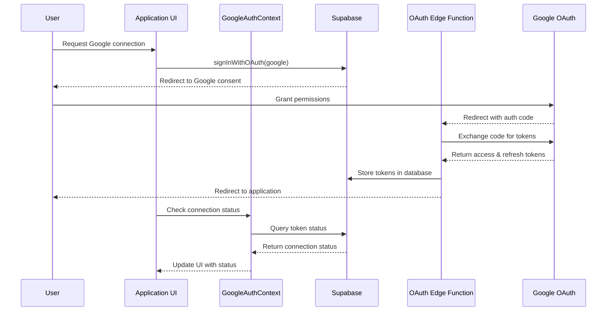

## 5. Google Workspace Agent Workflow

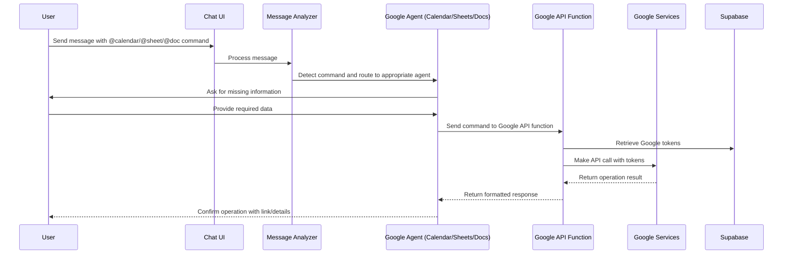

## 6. Token Refresh and Permission Verification

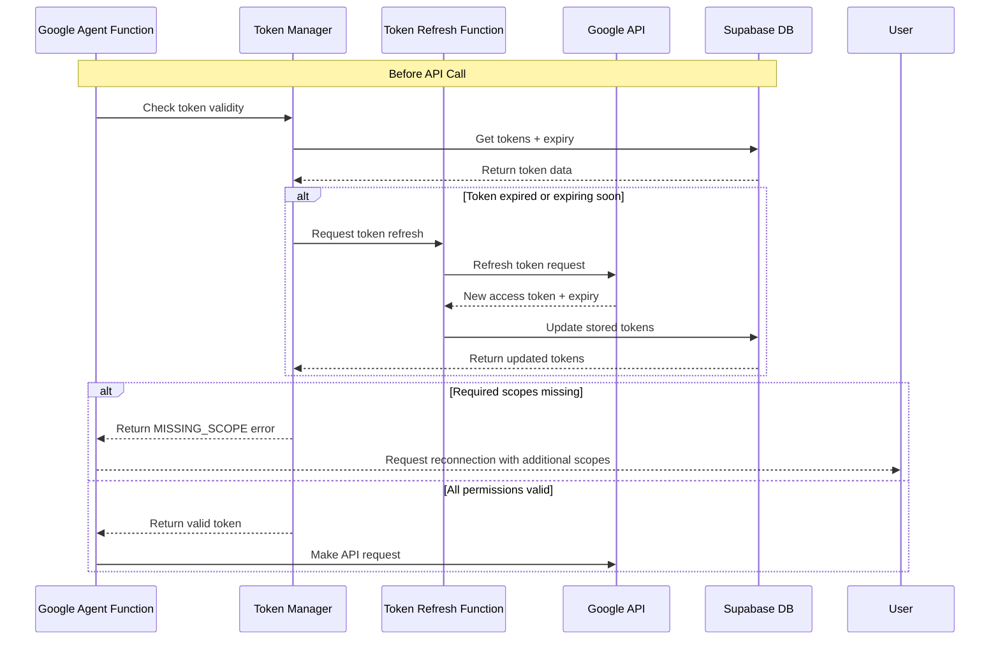

## 7. Memory System Workflow

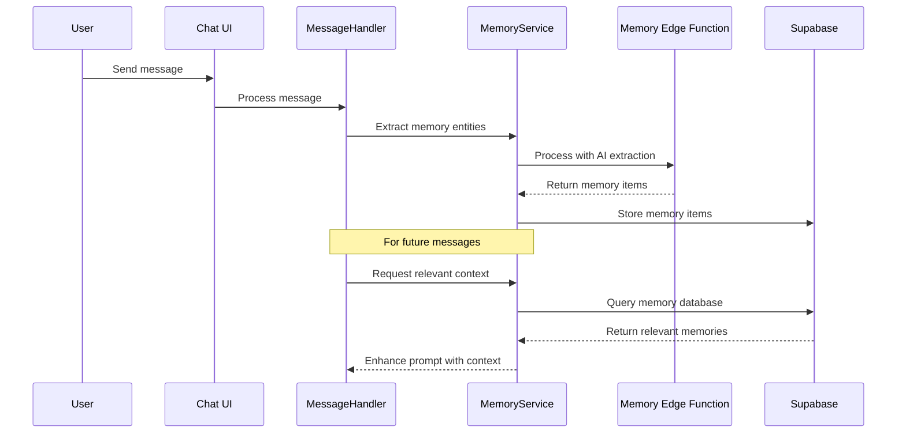

## 8. Token Management Workflow

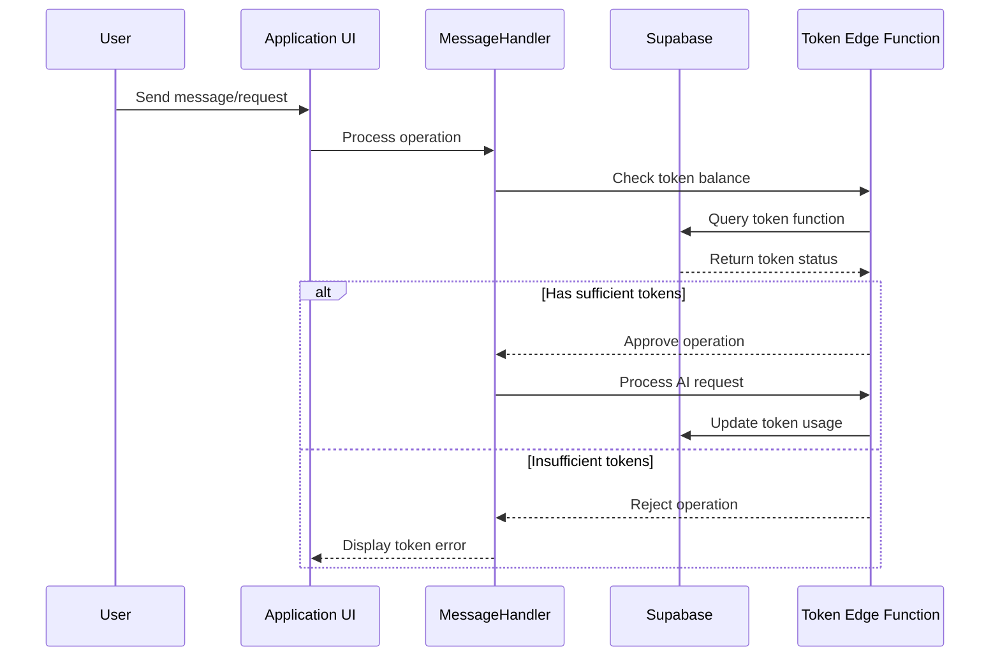

## 9. Media Gallery Workflow

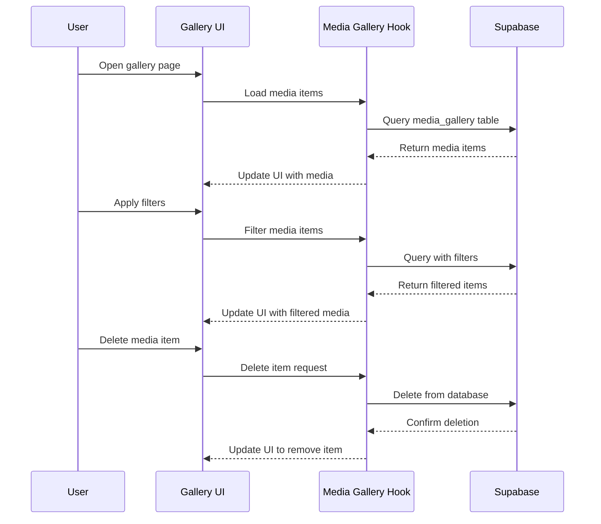

## 10. Error Handling Workflow

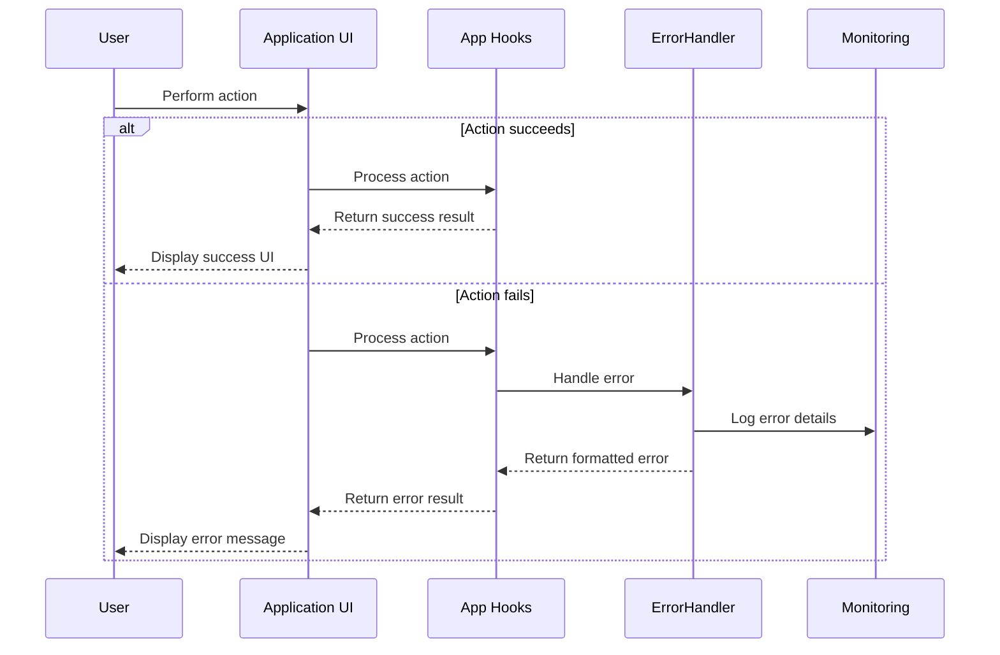

## 11. Application Initialization Workflow

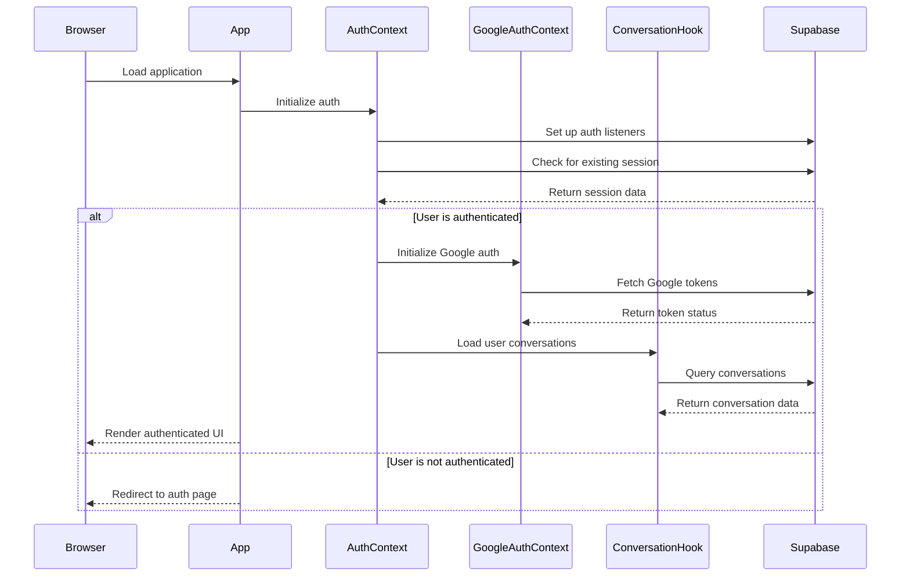

## 12. Google Calendar Agent Workflow

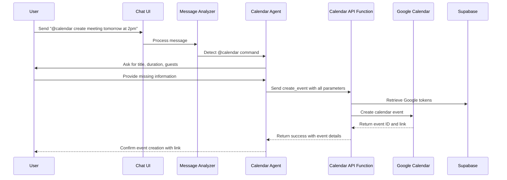

## 13. Google Sheets Agent Workflow

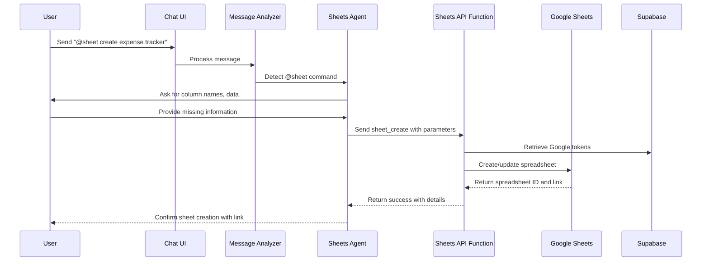

## 14. Google Docs Agent Workflow

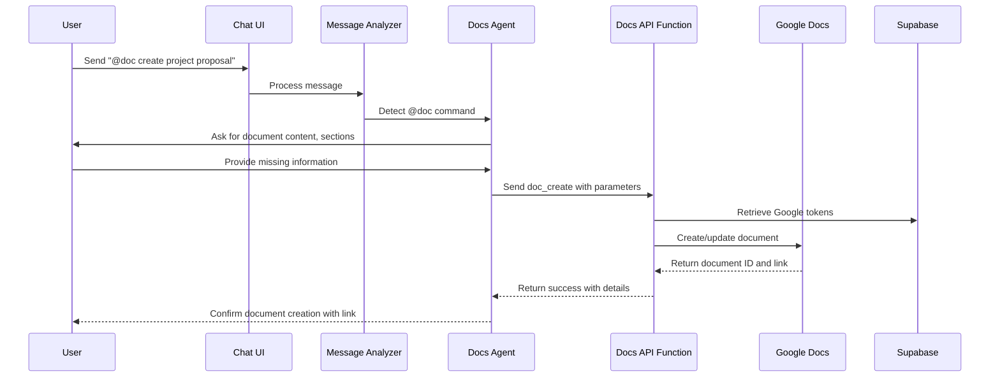

This technical workflow documentation provides detailed sequence diagrams for the major processes in the application, making it easier to understand the interaction between different components and services.
