# Technical Workflow Documentation

## 1. User Authentication Flow

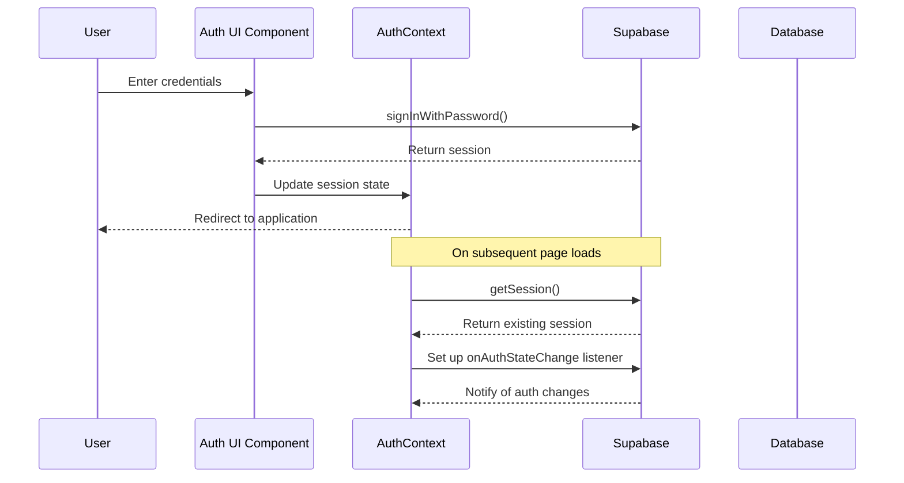

## 2. Conversation Creation and Message Flow

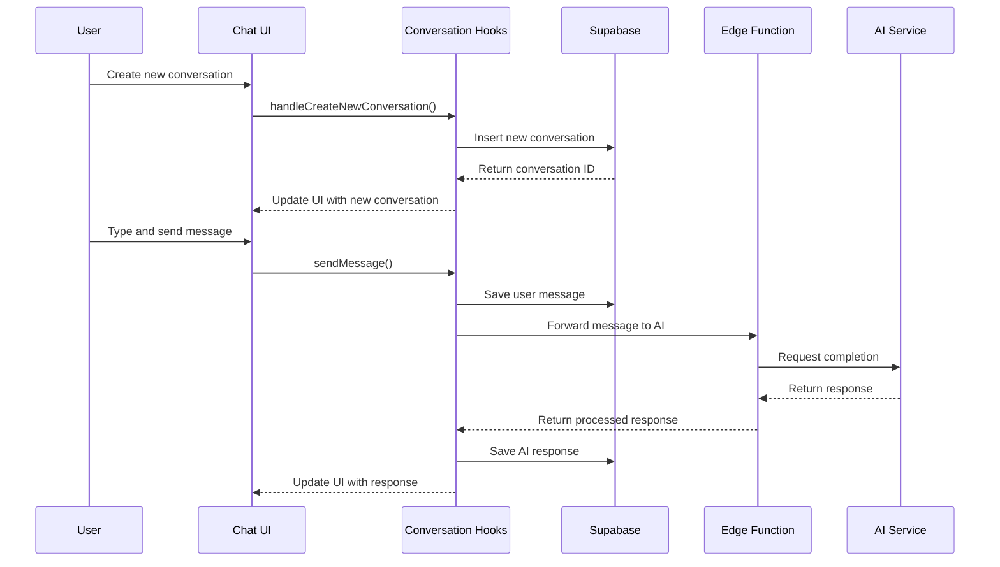

## 3. Media Generation Workflow

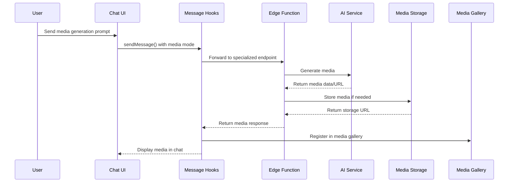

## 4. Google Integration Workflow

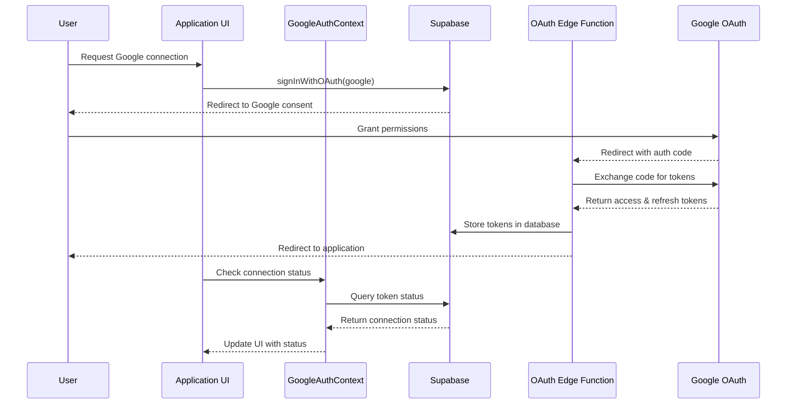

## 5. Memory System Workflow

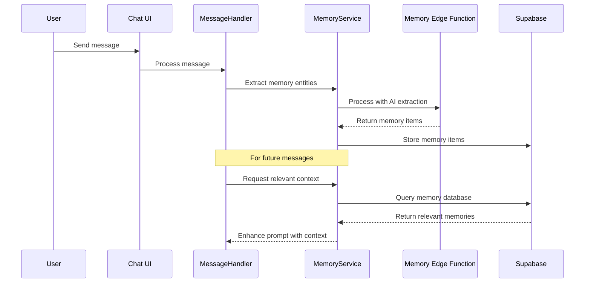

## 6. Token Management Workflow

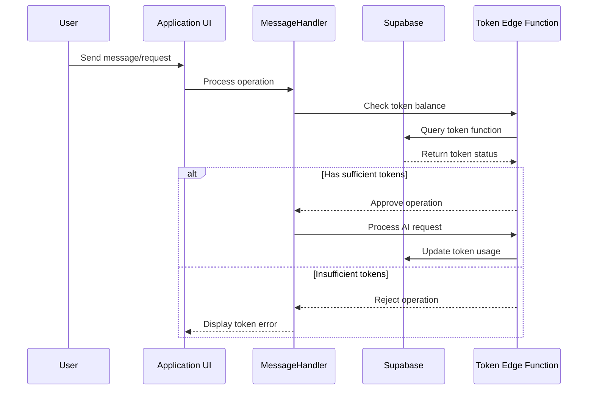

## 7. Media Gallery Workflow

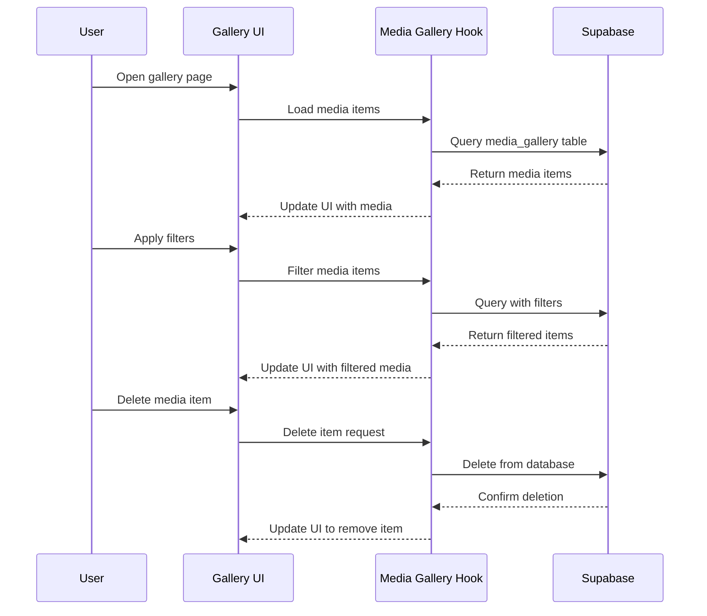

## 8. Error Handling Workflow

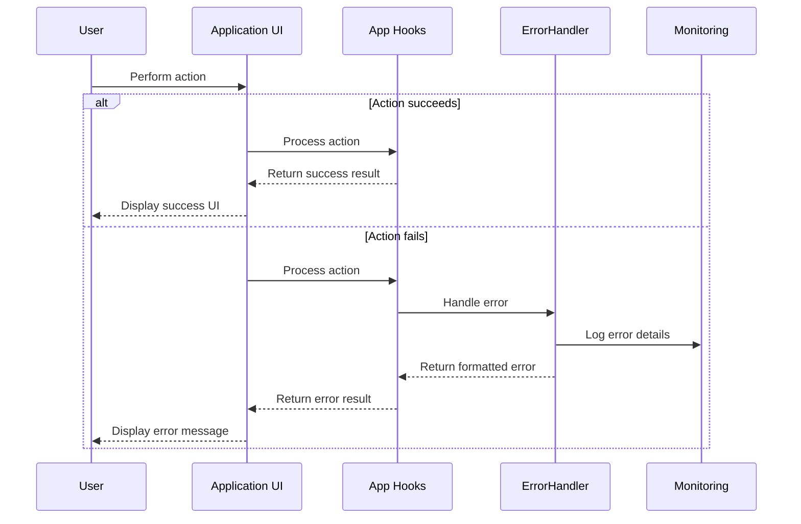

## 9. Application Initialization Workflow

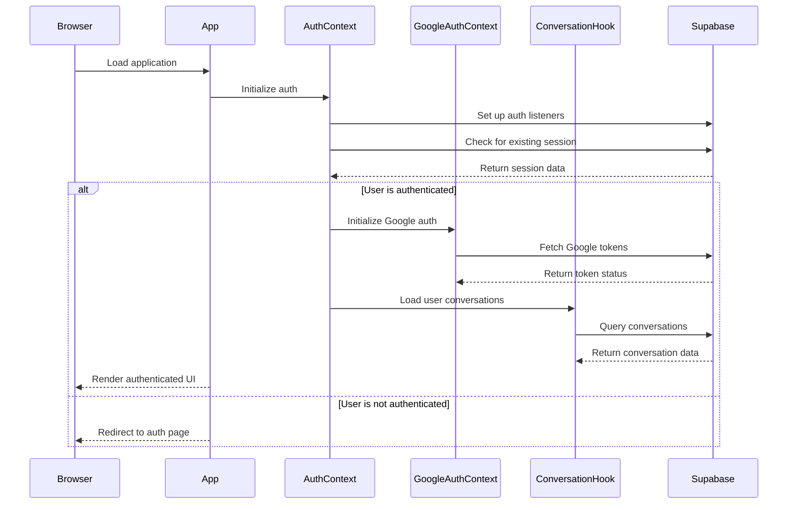

## 10. Session Refresh Workflow

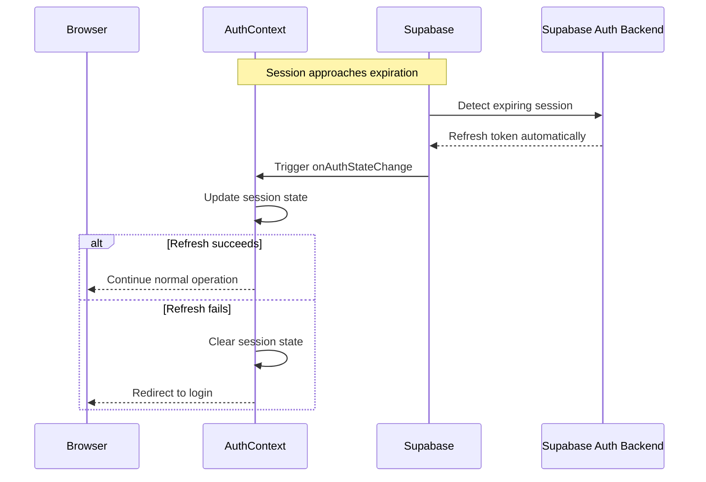

## 11. API Request Workflow

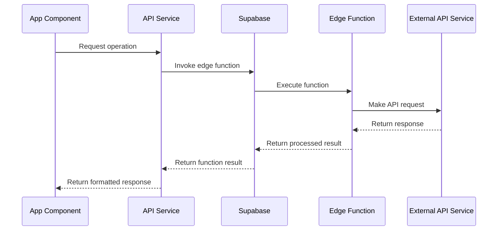

## 12. Multi-Modal AI Routing Workflow

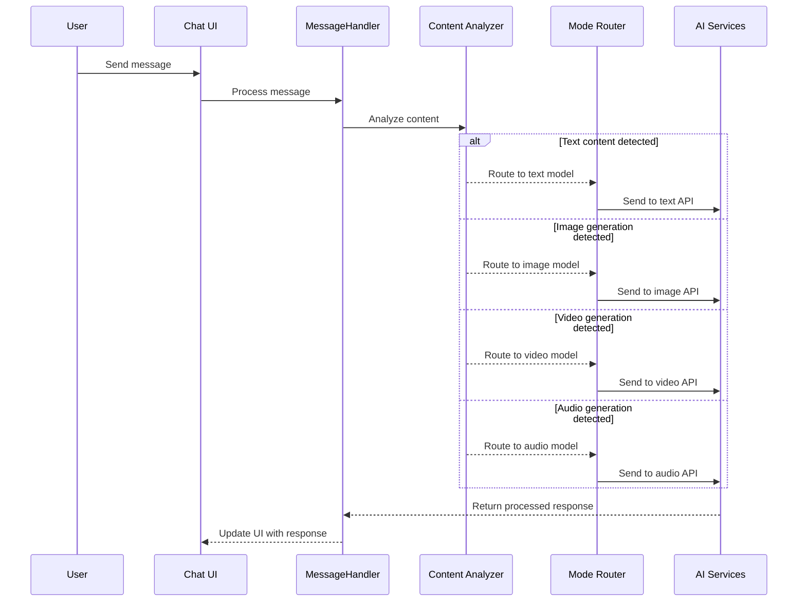

This technical workflow documentation provides detailed sequence diagrams for the major processes in the application, making it easier to understand the interaction between different components and services.
